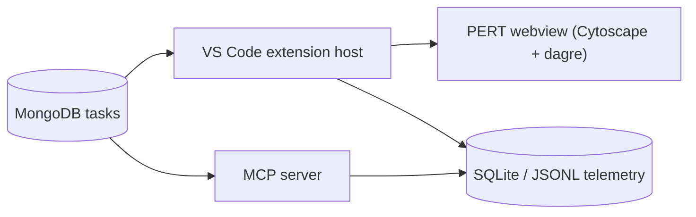

# Arquitectura de Cortex

## Resumen

Cortex separa claramente almacenamiento de tareas, visualización y automatización:

## Decisiones principales

### 1. `packages/core` como capa de dominio compartida

Se agregó un paquete compartido no pedido explícitamente porque evita duplicar:

- schema y normalización de tareas Mongo
- construcción y validación del DAG
- detección de ciclos
- snapshot estable para webview y MCP
- seed dataset

Tradeoff: un paquete extra en el monorepo, pero reduce acoplamiento y divergencia.

### 2. Mongo para tareas; SQLite para telemetría

- **MongoDB** mantiene los documentos de tareas y dependencias explícitas (`depends_on`).
- **SQLite** guarda corridas, duración, costos y metadatos de observabilidad.
- **JSONL** queda disponible como fallback sencillo si SQLite no se desea usar.

Justificación: Mongo encaja bien con tareas documentales; SQLite es mejor para consultas locales de corridas y sumarios de costo.

### 3. Extensión VS Code con host -> snapshot -> webview

El webview no abre conexiones a Mongo. El flujo es:

1. extensión host consulta Mongo
2. usa `packages/core` para armar snapshot estable
3. serializa JSON y lo envía al webview
4. el webview renderiza DAG y persiste viewport/selección

Esto reduce superficie de ataque, simplifica permisos y mantiene la lógica crítica fuera del DOM.

### 4. Cytoscape + dagre

Se eligió Cytoscape.js con dagre porque:

- soporta DAG jerárquico estable
- tolera refrescos frecuentes mejor que layouts físicos
- permite resaltar upstream/downstream fácilmente
- es suficiente para MVP sin introducir una arquitectura visual más pesada

### 5. MCP con herramientas pequeñas

El servidor MCP expone operaciones directas y estables:

- `task_list`
- `task_get`
- `task_ready_list`
- `task_blockers`
- `task_downstream`
- `graph_snapshot`
- `critical_path_estimate`
- `telemetry_recent_runs`
- `telemetry_cost_summary`
- extra: `task_cycles`

Las respuestas se serializan con orden estable para reducir ruido entre corridas.

### 6. Costo desacoplado y versionado

`packages/telemetry/src/pricing.ts` centraliza pricing por versión:

- `billing_mode = exact | estimated | unavailable`
- `pricing_version`
- `cached_input_tokens`

Esto evita hardcodes dispersos y permite actualizar precios sin tocar toda la base.

- **Notes & Logs panels**  Webviews independientes sobre el mismo SharedMongoClient. Notes permite CRUD; Logs es read-only. Ambos tienen su bundle esbuild minificado propio (`media/notes.js`, `media/logs.js`).
- **Python Script Flow analyzer**  El host usa `web-tree-sitter@0.26.8` y el asset `tree-sitter-python.wasm` derivado de `tree-sitter-python@0.25.0`. Para regenerarlo: `corepack pnpm --filter cortex add web-tree-sitter` + `corepack pnpm --filter cortex add -D tree-sitter-python` y luego `pnpm --filter cortex build` para recopiarlos a `apps/vscode-extension/media/`.

## Modelo de datos

Campos centrales:

- `code`
- `short_task`
- `detail`
- `status`
- `agent`
- `severity`
- `tags`
- `depends_on`
- `duration_estimate`
- `lane`
- `order_hint`
- `source_ref`
- `created_at`
- `updated_at`

## Validación de ciclos

Se implementa en `packages/core/src/graph.ts`:

- validación al construir el grafo
- mensaje legible por ciclo detectado
- comando CLI `pnpm check:cycles`
- comando VS Code `Cortex: List dependency cycles`
- tool MCP `task_cycles`

## Telemetría

Cada corrida puede guardar:

- IDs: `run_id`, `trace_id`, `session_id`
- contexto: `source`, `actor`, `tool_name`, `provider`, `model`
- uso: tokens input/output/cached/reasoning/total
- costo: `estimated_cost_usd`, `billing_mode`, `pricing_version`
- estado: `success`, `error_code`, `error_message`, duración
- metadata: queries Mongo, tamaño de payload, cantidad de nodos/aristas, tool calls encadenados

## Backlog no implementado

- edición inline de tareas desde la extensión
- suscripción reactiva a cambios Mongo con change streams
- agrupación visual por lane/swimlane en el webview
- exportación OpenTelemetry además del store local
- snapshots históricos persistidos explícitamente
- layout alternativo secundario para exploración libre
- tests E2E reales de extensión VS Code
- prompts MCP más ricos con salidas tipadas
- autenticación/ACL si se quisiera usar fuera de entorno local

## Checklist de aceptación

- [x] extensión preparada para abrir en VS Code
- [x] navegación textual lateral con secciones ready, blocked y agrupaciones
- [x] webview DAG jerárquico basado en dependencias explícitas
- [x] panel de detalle en el webview
- [x] Mongo como fuente de verdad
- [x] webview sin acceso directo a Mongo
- [x] MCP con tools/resources/prompts mínimos
- [x] telemetría local con costo/tokens/duración
- [x] detección de ciclos y comando para listarlos
- [x] pricing versionado y `billing_mode`
- [x] seeds y scripts de inspección
- [x] base modular lista para crecer
