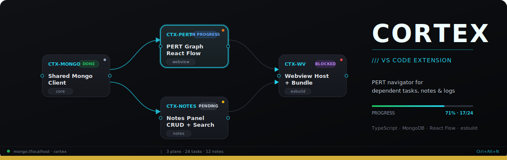

# Cortex

Extensión de VS Code para visualizar y operar sobre tareas dependientes, notas y logs almacenados en MongoDB local.

[](https://www.typescriptlang.org/)
[](https://nodejs.org/)
[](https://www.mongodb.com/)
[](https://code.visualstudio.com/api)
[](https://reactflow.dev/)

## Qué resuelve

Cortex nace como herramienta interna para no perder de vista el estado de planes complejos: refactors largos, dependencias entre tareas, notas técnicas y logs operativos.

El problema concreto que ataca: cuando un plan tiene veinte tareas con dependencias cruzadas y varias semanas de ejecución, el listado plano no alcanza. Hace falta un grafo navegable, persistencia entre sesiones y un panel de notas a un atajo de distancia.

## Capacidades principales

- Sidebar con árbol de tareas agrupadas por plan.
- Webview con grafo PERT/DAG basado en React Flow, layout jerárquico vía Dagre.
- Panel de notas con búsqueda en vivo, tags, vínculos opcionales a tarea o plan, pinned notes.
- Panel de logs read-only con los últimos eventos persistidos.
- Panel switcher (`Ctrl+Alt+N`, `Ctrl+Alt+Shift+N`) para saltar entre superficies.
- Filtros por plan, proyecto, grupo, tags, estados y severidad — todos persistidos.
- Detección automática de ciclos en dependencias.

## Vista de arquitectura

```text
VS Code Extension Host (Node)
   |
   |-- SharedMongoClient (singleton, pool reutilizado)
   |     |
   |     |-- MongoTaskStore       (tareas + ensureIndexes)
   |     |-- MongoActionPlanStore (planes + ensureIndexes)
   |     |-- MongoNoteStore       (notas + ensureIndexes)
   |     '-- Logs collection       (read-only)
   |
   |-- ExtensionTaskService
   |     '-- buildGraphSnapshot (puro, en memoria)
   |
   '-- Webviews (esbuild, IIFE, minificado en prod)
         |-- PERT Graph    (React + React Flow + Dagre)
         |-- Notes Panel   (React + Markdown editor)
         |-- Logs Panel    (React + listado paginado)
         '-- Script Flow   (TS / Python / SQL)
```

El webview nunca habla directo con MongoDB. La extensión resuelve los datos en el host y envía snapshots JSON serializados.

## Decisiones de diseño relevantes

- **Cliente Mongo compartido.** Una sola instancia de `MongoClient` por sesión de extensión, abierta en `activate()` y cerrada en `deactivate()`. Antes se abría y cerraba por cada operación, lo que multiplicaba handshakes en cada refresh.
- **Filter state persistente.** Zoom, pan, plan seleccionado y filtros sobreviven al reinicio de VS Code. Merge estructural defensivo contra workspaceState con shape antiguo.
- **Algoritmos puros sobre datos en memoria.** El topological sort usa Kahn's en O(V+E), evitando ordenamientos dentro del loop. Las cargas masivas usan `bulkWrite` con `ordered: false`.
- **Índices Mongo idempotentes.** `ensureIndexes()` se llama al activar la extensión. Los `code_unique` son partial filter (solo donde el campo existe y es string) para tolerar datos legacy.
- **Bundle minificado en producción.** Cuatro entry points esbuild (extension, graph, notes, logs) con sourcemaps linked. El watch mode no minifica para conservar legibilidad en errores.
- **Logging estructurado.** El extension host no usa `console.log`; toda observabilidad pasa por un logger configurable (pretty / json) con contexto por componente.

## Componentes

- `apps/vscode-extension` — extensión de VS Code con navegación textual y webview PERT/DAG.
- `apps/mcp-server` — servidor MCP local con tools, resources y prompts sobre tareas y telemetría.
- `packages/core` — dominio compartido: tipos, normalización Zod, grafo, Mongo y seeds.
- `packages/telemetry` — capa reusable de telemetría, pricing versionado, logging y persistencia local.

## Stack

- **TypeScript** estricto en todo el monorepo.
- **MongoDB** local como fuente de verdad.
- **React + React Flow + Dagre** para el grafo en webview.
- **esbuild** para bundling (extension host CJS, webviews IIFE).
- **Zod** para normalización defensiva de documentos.
- **Vitest** para tests unitarios.
- **pnpm workspaces** como gestor de paquetes.

## Panels & keyboard shortcuts

La extensión VS Code expone cinco superficies. Todas viven sobre el mismo `SharedMongoClient` (sin handshakes por operación).

| Superficie | Comando | Keybinding |
|------------|---------|------------|
| Task Navigator (sidebar) | `cortex.openTasks` |  |
| PERT Graph | `cortex.openGraph` |  |
| Notes | `cortex.openNotes` / `cortex.newNote` | `Ctrl+Alt+Shift+N` / `Ctrl+Alt+N` |
| Logs | `cortex.openLogs` |  |
| Script Flow | `cortex.openScriptFlow` / `cortex.openScriptFlowForSelection` |  |
| Panel switcher | `cortex.switchPanel` |  |

Desde cualquier panel, `cortex.showOptions` abre un QuickPick con acceso a Tasks/Graph/Notes/Logs y al resto de filtros.

## v0.1.3

La rama `v0.1.3` cierra el ciclo de Notes + Reminders + Script Flow dentro de la extensión.

### Reminders en Notes

- Cada nota puede guardar un `remindAt` one-shot desde el editor del panel Notes.
- La campana en status bar muestra cuántos recordatorios siguen pendientes y abre Notes filtrado por recordatorios.
- Al iniciar VS Code, la extensión ejecuta `fireDue(..., "startup")` y después reprograma timers con `scheduleAll(...)`, así que los reminders vencidos mientras VS Code estaba cerrado vuelven a dispararse al reabrir.
- El flujo de reminder soporta `snooze` y `dismiss`: posponer mueve `remindAt` hacia adelante y limpia `remindedAt`; descartar marca `remindedAt` para evitar reprocesarlo.

### Script Flow panel

- El panel Script Flow ya analiza archivos `.ts`, `.tsx`, `.py` y `.sql`.
- Se puede abrir con `Cortex: Open Script Flow` o desde el context menu del editor.
- Si hay selección activa, `Cortex: Open Script Flow for Selection` limita el análisis al rango elegido.
- El panel mantiene navegación por nodos, drawer analítico, telemetry de interacción y click-to-range sobre el editor.
- SQL se resuelve en el extension host con `node-sql-parser`, intentando `postgresql` y luego `mysql` como fallback.

### Comandos nuevos y relevantes

- `cortex.openNotes`
- `cortex.newNote`
- `cortex.editNote`
- `cortex.deleteNote`
- `cortex.snoozeReminder`
- `cortex.openLogs`
- `cortex.openScriptFlow`
- `cortex.openScriptFlowForSelection`
- `cortex.togglePlanStatusFilter`

### Limitaciones conocidas

- Script Flow sigue siendo single-file: no resuelve imports ni dependencias cross-file.
- SQL cubre el MVP de `WITH`/CTE, `SELECT`, `JOIN` y subqueries comunes; no intenta cobertura total del lenguaje.
- Reminders son one-shot; no hay recurrencia ni calendario complejo.
- Los smoke tests manuales de UX siguen siendo recomendables antes del merge final porque el bundle y los fixtures no sustituyen una corrida interactiva completa en VS Code.

### Notes

Panel CRUD de notas persistido en la misma instancia Mongo que tareas/planes.

- Campos: `code`, `title`, `body` (markdown), `tags[]`, `taskCode?`, `planCode?`, `pinned`, `createdAt`, `updatedAt`.
- Comandos: `Cortex: Open notes panel`, `Cortex: New note`, `Cortex: Edit note`, `Cortex: Delete note`.
- Config: `cortex.mongoNotesCollection` (default `notes`).
- Índices: `code_unique`, `task_code_idx`, `plan_code_idx`, `updated_at_desc_idx`.

### Logs

Panel read-only que muestra los últimos 500 eventos persistidos en Mongo.

- Config: `cortex.mongoLogsCollection` (default `logs`).
- Índices: `logs_source_timestamp`, `logs_level_timestamp`, `logs_process_timestamp`.

## Scripts raíz

- `pnpm install`
- `pnpm dev`
- `pnpm build`
- `pnpm test`
- `pnpm lint`
- `pnpm mongo:up`
- `pnpm seed`
- `pnpm check:cycles`
- `pnpm inspect:snapshot`
- `pnpm inspect:telemetry:runs`
- `pnpm inspect:telemetry:failures`
- `pnpm inspect:cost`

## Documentación

- [Arquitectura](./README.architecture.md)
- [Desarrollo local](./README.development.md)
