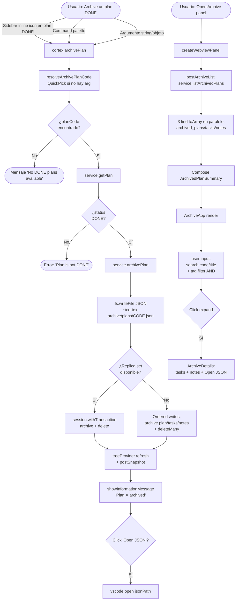

# Archive

Panel webview para revisar planes archivados. Los planes DONE se "congelan" moviéndolos de las colecciones activas (`tasks`, `notes`, `action_plans`) a colecciones espejo (`archived_*`) y guardando un snapshot JSON local en disco.

## Propósito

Resuelve un problema de higiene operativa: cuando un plan termina, sus tareas y notas dejan de aportar al [[task]] Navigator y al [[graph]] (ruido visual), pero **borrarlas pierde historia**.

El Archive ofrece:

- **Congelar**: el plan DONE + sus tareas + sus notas se mueven a colecciones `archived_*`. Las colecciones activas quedan más limpias.
- **Snapshot durable**: además del move-in-Mongo, se escribe un JSON en `~/cortex-archive/plans/<code>.json` con todo el estado al momento del archive.
- **Revisar**: el panel lista los plans archivados con search por código/título, filtro por tags, y detalle expandible con tasks + notes preservadas.
- **Auditoría rápida**: cada task archivada conserva `status`, `completedAt`, `completionNote`, `commitHash` — los datos que importan para una postmortem.

Es el panel de **historia**. Lo abres cuando alguien pregunta "¿qué hicimos con el plan X?" o cuando quieres ver cómo se cerró un refactor.

## Modelo de datos

`ArchivedPlanSummary` (definido en `apps/vscode-extension/src/service.ts:59-70`):

| Campo                     | Tipo                    | Notas                                                             |
| ------------------------- | ----------------------- | ----------------------------------------------------------------- |
| `code`                    | string                  | Identificador del plan original.                                  |
| `title`                   | string                  | Título del plan.                                                  |
| `completedAt`             | string?                 | Fecha de cierre del plan (campo del propio plan).                 |
| `archivedAt`              | string?                 | Fecha en que se ejecutó `archivePlan` — la genera el host.        |
| `tags`                    | string[]                | Heredados del plan. Filtrable en el panel.                        |
| `taskCount` / `noteCount` | number                  | Conteos rápidos para la fila resumen.                             |
| `jsonPath`                | string                  | Ruta absoluta al JSON snapshot en disco.                          |
| `tasks`                   | `ArchivedTaskSummary[]` | code, shortTask, status, completedAt, completionNote, commitHash. |
| `notes`                   | `ArchivedNoteSummary[]` | title, body, createdAt, tags.                                     |

**Colecciones Mongo involucradas** (hardcoded en `service.ts:206-208`, no configurables):

- `archived_plans`
- `archived_tasks`
- `archived_notes`

**JSON snapshot en disco** (`~/cortex-archive/plans/<code>.json` o el path del setting `cortex.archivePath`):

```json
{
  "archived_at": "<ISO>",
  "plan": { ...documento Mongo original con _id... },
  "tasks": [ ... ],
  "notes": [ ... ]
}
```

## Flujo de uso



## Arquitectura técnica

```mermaid
flowchart LR
    subgraph ExtHost[Extension Host]
        ArchCmd[cortex.archivePlan<br/>extension.ts:948]
        Resolve[resolveArchivePlanCode<br/>extension.ts:1277]
        Open[openArchivePanel<br/>extension.ts:416]
        Post[postArchiveList<br/>extension.ts:236]
        ArchSvc[service.archivePlan<br/>service.ts:194]
        ListSvc[service.listArchivedPlans<br/>service.ts:298]
        Path[resolveArchivePath<br/>service.ts:640<br/>setting cortex.archivePath]
    end

    subgraph Mongo[(MongoDB)]
        ActivePlans[action_plans]
        ActiveTasks[tasks]
        ActiveNotes[notes]
        ArchPlans[archived_plans]
        ArchTasks[archived_tasks]
        ArchNotes[archived_notes]
    end

    subgraph Disk[Filesystem]
        Json[~/cortex-archive/plans/CODE.json]
    end

    subgraph WebView[Webview React IIFE]
        App[ArchiveApp.tsx]
        Details[ArchiveDetails]
    end

    ArchCmd --> Resolve
    ArchCmd --> ArchSvc
    ArchSvc --> ActivePlans
    ArchSvc --> ActiveTasks
    ArchSvc --> ActiveNotes
    ArchSvc -->|move + delete| ArchPlans
    ArchSvc --> ArchTasks
    ArchSvc --> ArchNotes
    ArchSvc --> Json
    ArchSvc --> Path

    Open --> Post
    Post --> ListSvc
    ListSvc --> ArchPlans
    ListSvc --> ArchTasks
    ListSvc --> ArchNotes
    Post -->|postMessage archive:list| App
    App --> Details
    Details -->|archive:openJson jsonPath| Open
```

**Puntos clave del flujo de datos**:

- **`archivePlan` es destructivo de las colecciones activas**: `deleteMany` sobre tasks/notes/plan tras copiar a `archived_*` (`service.ts:258-260`). Sin transacción, una falla intermedia deja inconsistencia.
- **Transacción con fallback**: intenta `session.withTransaction`; si falla (típico en Mongo single node sin replica set), repite los mismos writes sin sesión (`service.ts:276-285`). El catch logea warn y continúa.
- **JSON snapshot se escribe SIEMPRE primero** (`service.ts:234-247`), antes del move. Si todo lo demás falla, el JSON queda como backup en disco.
- **`listArchivedPlans` ensambla en memoria**: 3 `find({}).toArray()` en paralelo + join por `plan_code` y `task_code` (`service.ts:302-347`).

## Fortalezas

1. **Snapshot a disco antes del move**. Garantiza un backup durable aunque el move en Mongo se quede a mitad. Buena propiedad de "fail-safe".
2. **`session.withTransaction` con fallback**. Reconoce que Mongo single node no soporta transacciones y degrada en lugar de crashear (`service.ts:276-288`).
3. **Reconciliación de mismatch** logueada (`service.ts:262-271`). Si `deletedCount` no coincide con lo esperado, queda evidencia en el logger estructurado.
4. **Solo planes DONE pueden archivarse**. Doble check: en el QuickPick (`extension.ts:1290`) y en `archivePlan` (`service.ts:214`). Evita archivar planes activos por error.
5. **`tags` heredados** del plan filtran el panel sin código extra.
6. **`completionNote` y `commitHash`** preservados por task (`service.ts:326-334`). Información clave para postmortems.
7. **CSP estricta + nonce** igual que los otros webviews.
8. **`Open JSON`** abre el snapshot en un editor de VS Code. Buena affordance: el JSON es human-readable y greppeable.
9. **Filtro de tags persiste al refresh** y se sanitiza si los tags ya no existen (`ArchiveApp.tsx:36`).
10. **Empty state diferenciado** del "no matches" — mismo patrón sano que Logs.

## Debilidades y problemas detectados

### Bugs y comportamientos confusos

1. **`archive:openJson` no valida la ruta** (`extension.ts:442`). El extension host abre `vscode.Uri.file(message.jsonPath.trim())` directo. El webview es código propio, no untrusted, pero el principio de validación de input en el host se viola. Un bug en el webview podría llevarte a abrir cualquier archivo del sistema.
2. **`completionNote` y `commitHash` no se muestran si la task original no los tenía**, pero el panel siempre escribe "completion date unavailable" cuando falta `completedAt`. Inconsistencia: a veces oculta el campo, a veces dice "unavailable".
3. **Filtro de tags es AND duro** (`ArchiveApp.tsx:48`): seleccionar 3 tags exige los 3 simultáneos. Para archives grandes esto es muy restrictivo. No hay toggle a OR.
4. **`tags` del plan se muestran como filtros**, pero **no las tags de las tareas**. Si tenías una tarea con tag `infra` y el plan no, no la encuentras desde el panel.
5. **El JSON snapshot incluye `_id` ObjectIds**. No es bug, pero al abrir el JSON ves `{"$oid":"..."}` que confunde al usuario que no sabe Mongo.

### UX

6. **No hay restore/unarchive**. Si archivaste por error o necesitas reabrir un plan, la única salida es editar Mongo a mano o ejecutar manualmente un script. Falta `cortex.restorePlan`.
7. **No hay delete de archived plans**. Para limpiar archive antiguo, no existe UI. El JSON queda en disco y los `archived_*` siguen creciendo.
8. **No se muestra `archivePath`** en el panel. El usuario no sabe dónde están sus JSON snapshots a menos que abra settings.
9. **Sin búsqueda en task/note bodies**. La búsqueda solo cubre `code` y `title` del plan (`ArchiveApp.tsx:54`). Si recuerdas que un plan archivado contenía la frase "fix indexer race", no la encuentras.
10. **Sin sort configurable**. Lista hardcoded por `archivedAt desc` (`service.ts:347`). El usuario no puede ordenar por `taskCount`, `noteCount`, ni `completedAt`.
11. **Sin paginación**. 50+ planes archivados → todo en una sola lista DOM-pesada.
12. **`Open JSON` solo abre**. Faltan "Reveal in OS Explorer", "Copy path to clipboard", "Open containing folder".
13. **No hay export ZIP/tarball** del archive completo. Para mover toda la historia a otra máquina, hay que copiar el directorio a mano.
14. **Sin indicador visual de antigüedad**. Un archive de hace 3 días se ve igual que uno de hace 2 años. Útil tener chip "Today / This week / 30d / Older".
15. **`description`, `goal`, `context` del plan no se muestran en `ArchiveDetails`**. El `ActionPlanRecord` los tiene, el snapshot JSON los preserva, el detail panel los ignora. Pérdida de información valiosa al revisar postmortem.
16. **Logs vinculados no se preservan**. Si el plan tenía ejecuciones (executionId) en `logs`, no se incluyen en el JSON ni se referencian. Cuando archivas, perdés el rastro operativo.

### Lógica

17. **Inconsistencia transaccional posible**. Sin replica set + falla intermedia entre `archiveDocuments` y `deleteMany` = datos duplicados en `archived_*` y `*` activos. El warn log existe pero no hay reconciliación automática.
18. **`archived_*` collections son hardcoded** (`service.ts:206-208`). Ni en `getConnectionSettings` ni configurables vía setting. Patrón inconsistente vs `mongoTasksCollection` que sí lo es.
19. **`listArchivedPlans` carga todo en memoria**. 3 `find({}).toArray()` sin proyección, sin paginación. Funciona hasta ~1000 archived plans cómodamente; más allá empieza a doler.
20. **Sin verificación de integridad post-archive**. ¿Quedó algo en la colección activa? ¿El JSON en disco se escribió completo? El warn de deleteCount no es suficiente.
21. **`resolveArchivePath` no valida la carpeta** (`service.ts:640`). Si el setting apunta a un path inaccesible, el JSON falla con un error críptico de `fs.writeFile`.
22. **`getPlan` en command y `archivePlan` interno hacen dos lecturas del mismo plan** (`extension.ts:954` + `service.ts:210`). Race pequeña: en el medio el plan podría cambiar de estado.

### Proceso / publicación

23. **Sin tests del flujo de archive**. `archivePlan` (lógica de móveres + JSON) no tiene tests directos. Riesgo alto en cambio futuro.
24. **Sin documentación del directorio `~/cortex-archive`**. No se explica qué pasa si lo borras, ni si VS Code lo recrea.
25. **Sin migración de archive entre instalaciones**. No hay comando "Cortex: Export archive" / "Import archive".

## Mejoras propuestas

### Técnicas

- **Validar `jsonPath` en el host** (`extension.ts:442`): solo abrir si el path está dentro de `resolveArchivePath()` (o de los path de archive conocidos en `listArchivedPlans`). Defensa simple.
- **Verificación post-archive**: tras el move, contar `archived_tasks.count({plan_code})` vs `tasks.count({plan_code})` y log si difieren.
- **Setting `cortex.archivedCollections.*`** para hacer configurable lo hardcoded (consistencia con el resto).
- **Paginación con cursor `archivedAt`** en `listArchivedPlans` cuando el panel crezca. Hoy carga todo.
- **Proyección en `find()`** para no traer `_id` ObjectIds completos al normalize. Reduce payload del `postMessage`.
- **Cache del listado** con invalidación al ejecutar `archivePlan`. Hoy se recarga full cada `archive:refresh`.

### Visuales

- **Indicador de antigüedad**: chip `Today / 7d / 30d / Older` calculado en cliente sobre `archivedAt`.
- **Mostrar `archivePath` en el toolbar** con botón "Open archive folder".
- **Toggle AND/OR** en filtros de tag.
- **Sort selector**: archivedAt / completedAt / taskCount / noteCount.
- **Mostrar `plan.description`, `plan.goal`, `plan.context`** en `ArchiveDetails`. Hoy solo tags+tasks+notes.
- **Tags de tasks individuales** además de tags del plan. Y dejarlas filtrables.
- **Iconos por status de task**: misma paleta que el Graph para consistencia.
- **Badge de "logs vinculados"** si encontramos `executionId` en logs activos que matchean tasks del plan archivado.

### Lógicas

- **`cortex.restorePlan <code>`**: mover de archived\_\* a colecciones activas + cambiar status a `IN_PROGRESS`. Confirmación dura porque es operación inversa.
- **`cortex.deleteArchivedPlan <code>`**: borra de archived\_\* y opcionalmente el JSON. Confirmación dura + offer "keep JSON backup".
- **Búsqueda en task/note bodies** además de plan code/title. Costoso en cliente para muchos plans, pero el dataset es del orden de cientos no millones.
- **Incluir logs en el snapshot JSON**: en `archivePlan`, agregar `logs: db.logs.find({ task_code: { $in: taskCodes } }).toArray()` al payload. Cambio chico, gran valor para postmortems.
- **Export ZIP del archive**: `cortex.exportArchive` → empaqueta `~/cortex-archive/plans/*.json` + un `manifest.json` con metadata.

### Proceso / uso

- **Tests del flujo de archive** con un Mongo stub: archive en transacción, archive sin transacción (fallback), JSON write, listArchivedPlans con joins.
- **Documento `docs/archive.md`** (este mismo) referenciado desde el README.
- **Onboarding del panel vacío**: cuando no hay archived plans, explicar el ciclo "DONE → Archive → snapshot" con un ejemplo. Hoy dice "No archived plans match".

## Próximos pasos sugeridos (orden propuesto)

1. **Validar `jsonPath` en `archive:openJson`** — fix de seguridad, 10 min.
2. **Mostrar `archivePath` + "Open archive folder"** — 30 min, mucha claridad ganada.
3. **`cortex.restorePlan`** — alto valor (sin esto, archivar es de un solo sentido). ~2h con confirmaciones.
4. **Incluir logs en el JSON snapshot** — 30 min, preserva postmortem completa.
5. **`description/goal/context` en `ArchiveDetails`** — 15 min, recupera info ya guardada.
6. **Sort selector + indicador antigüedad + AND/OR de tags** — 1.5h total.
7. **`cortex.deleteArchivedPlan` con safeguards** — 1h. Higiene de largo plazo.
8. **Tests del archive flow** — 2h. Indispensable antes de marketplace.
9. **Export ZIP / Import** — 2h. Útil para mover historia entre máquinas.

## Tests existentes

- Ninguno cubre directamente `service.archivePlan` ni `service.listArchivedPlans`.
- Ninguno cubre `ArchiveApp.tsx`.
- `apps/vscode-extension/src/service.test.ts` tiene stubs generales del service pero no del archive flow específicamente.

**Gaps críticos**:

- Sin test de "archive transaccional vs fallback ordered".
- Sin test de "JSON snapshot escrito correctamente y reproducible".
- Sin test de "deleteCount mismatch → warn loguea pero el comando no crashea".
- Sin test del `resolveArchivePath` (default vs setting custom).

Este es el módulo con mayor brecha de tests vs riesgo (operaciones destructivas en Mongo).
