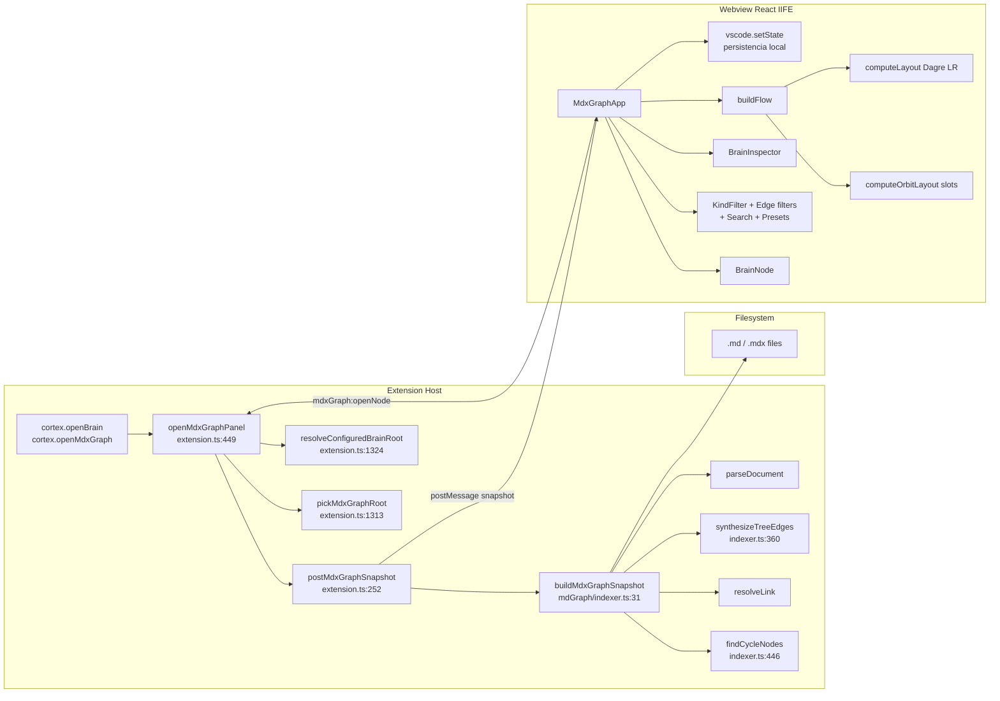

# Cortex Brain (MD Graph)

Panel webview que escanea una carpeta local de `.md`/`.mdx` y construye un grafo de conocimiento: documentos como nodos, links/tags/accounts como aristas, con detección de orphans, ciclos y broken refs. **No usa MongoDB** — opera 100% sobre el sistema de archivos.

Es el módulo más sofisticado del repo y el que está siendo iterado activamente en la branch `mdgraph-references-relation`.

## Propósito

Resuelve un problema de arquitectura de documentación: cuando un workspace tiene **decenas o cientos de páginas `.md`/`.mdx`** conectadas por tags, frontmatter `related:`, links y wikilinks, no hay forma de:

- Ver qué páginas están huérfanas (no cuelgan del b-tree de upstream/downstream).
- Detectar referencias rotas en `related:` antes de publicar.
- Identificar zonas poco conectadas vs hubs sobre-cargados.
- Inspeccionar la red de tags y accounts (entidades específicas del dominio del usuario) sin abrir página por página.

El Brain ofrece:

- **Scan local con exclusiones inteligentes** (`node_modules`, `.git`, `dist`, `build`, `.astro`, `.next`).
- **Síntesis del b-tree upstream/downstream desde la estructura de carpetas** (regla Starlight-style: `src/content/docs/<zone>/...`), no del frontmatter — para que la jerarquía siga al filesystem y no a glosas frágiles.
- **Cinco relaciones reconocidas en `related:`** (`upstream`, `downstream`, `references`, `standards`, `accounts`) + links body + wikilinks + tags + accounts.
- **Tres layouts**: `flow` (Dagre LR), `orbit` (orbital alrededor del seleccionado, con slots angulares por tipo de relación), y tres presets (`docs`, `refs`, `full`).
- **Inspector lateral** con overview de issues + drill-down por nodo + lista "Connected" con dirección y relación.
- **Cuatro tipos de issues**: orphan, cycle, self-reference, broken-ref.

Es el panel de **arquitectura de conocimiento**. Lo abres cuando quieres revisar la salud estructural de tu documentación, no a leer una página.

## Modelo de datos

Definido en `apps/vscode-extension/src/mdGraph/types.ts`.

### `MdxGraphNode`

| Campo                                    | Tipo                                | Notas                                                                     |
| ---------------------------------------- | ----------------------------------- | ------------------------------------------------------------------------- |
| `id`                                     | string                              | `doc:<relativePath>` / `tag:<name>` / `account:<id>` / `external:<slug>`. |
| `kind`                                   | `doc \| tag \| account \| external` | `external` es "unresolved reference".                                     |
| `label`                                  | string                              | Título o nombre para mostrar.                                             |
| `path`                                   | string?                             | fs path absoluto. Solo en nodos `doc`.                                    |
| `route`                                  | string?                             | Ruta web inferida (Starlight o `routeFromRelativePath`).                  |
| `title` / `description`                  | string?                             | Del frontmatter.                                                          |
| `domain` / `layer` / `docKind` / `badge` | string?                             | Frontmatter del workspace del usuario (no estándar Markdown).             |
| `tags`                                   | string[]?                           | Del frontmatter.                                                          |
| `isOrphan`                               | boolean?                            | Doc sin upstream/downstream tras la síntesis.                             |

### `MdxGraphEdge`

| Campo         | Tipo                                   | Notas                                                                          |
| ------------- | -------------------------------------- | ------------------------------------------------------------------------------ |
| `id`          | string                                 | `${kind}:${label}:${from}:${to}`.                                              |
| `from` / `to` | string                                 | IDs de nodo.                                                                   |
| `kind`        | `link \| tag \| account \| unresolved` | Categoría de arista.                                                           |
| `label`       | string?                                | `link \| upstream \| downstream \| references \| standards \| tag \| account`. |

### `MdxGraphIssue`

| Campo    | Tipo                                              | Notas                                             |
| -------- | ------------------------------------------------- | ------------------------------------------------- |
| `kind`   | `orphan \| cycle \| self-reference \| broken-ref` |                                                   |
| `nodeId` | string                                            | El nodo afectado.                                 |
| `detail` | string?                                           | Para `broken-ref`, contiene `<relation>: <href>`. |

### `MdxGraphSnapshot`

| Campo                        | Tipo       | Notas                                                                                   |
| ---------------------------- | ---------- | --------------------------------------------------------------------------------------- |
| `rootPath`                   | string     | Carpeta escaneada.                                                                      |
| `generatedAt`                | string ISO |                                                                                         |
| `nodes` / `edges` / `issues` | arrays     | El grafo completo.                                                                      |
| `stats`                      | objeto     | `fileCount`, `tagCount`, `accountCount`, `orphanCount`, `unresolvedCount`, `elapsedMs`. |

## Convenciones reconocidas

### Frontmatter

```yaml
---
title: "Título visible"
description: "Pitch corto"
domain: ventas
layer: standard
kind: page  # → docKind
badge: stable
tags: [foo, bar]   # inline
# o block:
tags:
  - foo
  - bar
related:
  references:
    - /path/a/doc
    - ./otro.md
  standards:
    - /standards/x
  accounts:
    - "1100"
  # upstream/downstream IGNORADOS — se derivan del filesystem
---
```

### Estructura de carpetas (para upstream/downstream)

```
<root>/src/content/docs/<zone>/<subpath>/index.md   ← padre del subtree
<root>/src/content/docs/<zone>/<subpath>/page.md    ← downstream del index
```

La síntesis del b-tree busca el `index.{md,mdx}` más cercano hacia arriba dentro de la misma "zone" (primer segmento bajo `content/docs/`).

### Body

- Markdown links `[text](href)`
- HTML `href="..."`
- Wikilinks `[[Name]]`
- Accounts inline vía regex `/manual-cuentas/.../(\d{4,})/`

## Flujo de uso

```mermaid
flowchart TD
    Trigger([Usuario: Open Cortex Brain])
    Trigger -->|Command palette| Open[openMdxGraphPanel]
    Trigger -->|Switch panel| Open

    Open --> Root{¿Root resuelto?}
    Root -->|"setting<br/>cortex.brainRootPath"| Has[selectedRoot listo]
    Root -->|"último usado<br/>currentMdxGraphRoot"| Has
    Root -->|"showOpenDialog<br/>pickMdxGraphRoot"| Has

    Has --> Create{¿panel<br/>existe?}
    Create -->|No| Build[createWebviewPanel<br/>+ getMdxGraphHtml]
    Create -->|Sí| Reveal[panel.reveal]
    Build --> Wait[webview 'ready']
    Reveal --> Post

    Wait --> Post[postMdxGraphSnapshot]
    Post --> Find[findFiles **/*.{md,mdx}<br/>excluye node_modules/.git/etc<br/>maxFiles default 800]
    Find --> ReadAll[readFile cada doc<br/>secuencial]
    ReadAll --> Parse[parseDocument:<br/>frontmatter manual<br/>+ body regexes]
    Parse --> Tree[synthesizeTreeEdges<br/>upstream/downstream<br/>desde fs structure]
    Tree --> Issues[detect orphans/cycles<br/>self-refs/broken-refs]
    Issues --> Snap[MdxGraphSnapshot]
    Snap --> PostMsg[postMessage<br/>mdxGraph:snapshot]

    PostMsg --> App[MdxGraphApp render]
    App --> Preset{Usuario elige preset}
    Preset -->|Docs| F1[flow + solo doc kind<br/>sin edges]
    Preset -->|Refs| F2[orbit + todos kinds<br/>+ todos edges]
    Preset -->|Full| F3[flow + todos kinds<br/>+ todos edges]

    F1 --> Action{Acción}
    F2 --> Action
    F3 --> Action

    Action -->|Click| Sel[setSelectedNodeId<br/>+ Inspector]
    Action -->|Double-click doc| OpenDoc[mdxGraph:openNode<br/>vscode.open ViewColumn.Beside]
    Action -->|Toggle edge filter| RebuildFlow[buildFlow + computeLayout]
    Action -->|Toggle kind / nodo| RebuildFlow
    Action -->|Search| RebuildFlow
    Action -->|Layout flow/orbit| RebuildFlow
    Action -->|Refresh| Post
    Action -->|Folder picker| Pick[pickMdxGraphRoot]
    Pick --> Post
```

## Arquitectura técnica



**Puntos clave del flujo de datos**:

- **No toca Mongo**. Cualquier panel Mongo puede estar caído y este sigue funcionando.
- **`findFiles` con `maxFiles=800`** (configurable: `cortex.mdxGraphMaxFiles`). Si el repo tiene más, los últimos **silenciosamente no se leen**.
- **`readFile` es secuencial** (`indexer.ts:42-53`) — un `await` por archivo, no `Promise.all`.
- **`synthesizeTreeEdges` sobrescribe upstream/downstream del frontmatter** (`indexer.ts:262-266`). Comportamiento intencional pero no obvio.
- **`vscode.setState(snapshot)`** persiste el snapshot completo en el webview state (`MdxGraphApp.tsx:92`). Reload del panel recupera sin re-scan, pero hay límite (~10MB en webview state).

## Fortalezas

1. **Independencia de Mongo**. Único panel que sigue funcionando si la base de datos no está. Esto es muy valioso para el caso "first run" y para degradación elegante.
2. **Síntesis del árbol desde fs**. El comentario en `indexer.ts:356-359` lo explica: replica la regla de un script Astro/Starlight. Permite que upstream/downstream sigan al filesystem aunque el frontmatter mienta. Acíclico por construcción.
3. **Detección de ciclos sobre subgrafo restringido**. `findCycleNodes` (`indexer.ts:446`) solo recorre upstream/downstream — si el frontmatter user mete un ciclo accidental, se marca. Las otras relaciones pueden ser cíclicas sin problema.
4. **Cuatro categorías de issues con severity** (`MdxGraphApp.tsx:53`): `cycle` > `broken-ref` > `self-reference` > `orphan`. El nodo se pinta con el peor issue que tenga.
5. **Resolución de links robusta** (`indexer.ts:309-339`): soporta rutas absolutas con/sin trailing slash, relativas `.md/.mdx`, y stems ambiguos (gana si hay 1 candidato).
6. **Orbital layout con slots semánticos** (`MdxGraphApp.tsx:605`): upstream a 180°, downstream a 0°, references a 90°, etc. Mapea posición a significado. Bonito.
7. **`vscode.setState` para persistencia**. Reload del panel no rehace el scan. Buen UX.
8. **Inspector con overview cuando no hay selección**. Stats + issues groupados. Convierte el panel en dashboard de salud documental.
9. **Aristas animadas para `references`** y dashed para `unresolved` (`MdxGraphApp.tsx:523-535`). Affordance visual rica.
10. **Click resetea selección a null al recibir snapshot nuevo** (`MdxGraphApp.tsx:91`) — bueno para no mostrar nodo inválido tras un cambio de carpeta.
11. **`KindFilter` con `<details>` disclosure**: lista checkboxes por nodo, plegable. UX denso pero potente para selección fina.
12. **`hiddenNodeIds` reconciliado al recibir snapshot**: filtra IDs que ya no existen (`MdxGraphApp.tsx:87-90`). Sin esto, los IDs viejos crecerían sin límite.

## Debilidades y problemas detectados

### Sesgo de uso (críticos para marketplace)

1. **`ACCOUNT_ROUTE_RE` es 100% específico del workspace `jean_d_arc`** (`indexer.ts:30`): `/\/manual-cuentas\/[^)\s"']+\/(\d{4,})\/?/g`. Para 99% de usuarios externos, esta funcionalidad es muerta. Debería ser opt-in con setting (`cortex.brainAccountPattern`) o detectado automáticamente.
2. **`domain` / `layer` / `docKind` / `badge` frontmatter fields** no son estándar Markdown. Específicos del autor. Para marketplace: documentar el contrato o detectar Astro Starlight automáticamente vs modo "genérico".
3. **`synthesizeTreeEdges` requiere estructura Starlight** (`src/content/docs/<zone>/...`, `indexer.ts:375`). Si tu workspace **no** es Astro/Starlight, **el b-tree no se sintetiza** y todos los docs son orphans. Sesgo de uso enorme sin aviso visual.
4. **`related:` block con sub-secciones `upstream/downstream/references/standards/accounts`** no es convención de ningún ecosistema markdown conocido. Es del workspace del usuario. Si publicas al marketplace, esto **debe documentarse** o convertirse en preset opt-in.

### Bugs y comportamientos confusos

5. **`maxFiles=800` con truncamiento silencioso**. `findFiles` devuelve los primeros 800 que matchean (en orden no determinístico). No hay aviso "Se truncó tu workspace, hay más docs". Para repos grandes, el grafo queda parcial sin que el usuario lo sepa.
6. **`upstream/downstream` del frontmatter se ignoran** (`indexer.ts:262-266`). El usuario que ya documentó relaciones manualmente queda confundido sin pista de por qué no aparecen.
7. **`isOrphan` solo considera upstream/downstream**. Un doc con 30 `references` salientes pero sin upstream/downstream se marca como orphan. La definición de "orphan" aquí es estricta y puede no ser intuitiva.
8. **`selectedNodeId` se resetea a `null` al recibir snapshot** (`MdxGraphApp.tsx:91`). Si refrescaste y querías ver el mismo nodo, pierdes la selección. Debería intentar reconciliar.
9. **`hiddenNodeIds` no se persiste** en `vscode.setState`. Al recargar el panel, vuelven todos visibles. Inconsistencia con la persistencia del snapshot.
10. **Stems ambiguos no se explican**. Si dos docs tienen mismo stem y un link los referencia, se crea broken-ref sin decir "ambiguo entre A.md y B.md".
11. **`parseFrontmatter` es regex manual** (`indexer.ts:194`). No usa `yaml` ni `gray-matter`. Falla silenciosamente con:

- Strings multi-línea (`|`, `>`).
- Mapas anidados.
- Comments YAML.
- Listas con comas escapadas.
- Comillas escapadas dentro de comillas.

12. **`extractLinks` por regex sobre el body** se traga links dentro de code blocks. Markdown ` ```...``` ` no se respeta. Falsos positivos.
13. **`vscode.setState(snapshot)`** con snapshot grande puede chocar contra el límite de state del webview (~10MB). Para 1000+ docs el límite se acerca. Falla silenciosa.
14. **`mdxGraph:openNode` valida `node.kind === "doc"` y `node.path`** (`extension.ts:501`) pero **no valida que `node.path` esté dentro de `currentMdxGraphRoot`**. Defensa mínima recomendada.
15. **`isSnapshot` es muy permisivo** (`MdxGraphApp.tsx:815`): solo chequea `rootPath` string y `nodes`/`edges` arrays. Datos corruptos en `vscode.getState()` pueden pasar.

### UX

16. **Sin file watcher**. Editas un `.md`, guardas, el grafo queda viejo. Hay que clic en Refresh manual.
17. **Sin search interna en `KindFilter`**. Para 200 docs, la lista de checkboxes es muy larga sin manera rápida de encontrar uno.
18. **Sin paginación / "show more"** en `BrainInspector.related` (limita a 24, `MdxGraphApp.tsx:450`). Los restantes simplemente no aparecen.
19. **Presets sin tooltip explicativo**. `Docs`, `Refs`, `Full` no dicen qué cambian.
20. **Sin export del snapshot a JSON** ni del grafo a PNG/SVG. Los mismos gaps que [[graph]].
21. **Sin botón "Find broken refs" list**. Issues están en el inspector pero no como reporte exportable.
22. **`mdxGraph:openNode` solo funciona en `doc`**. Tag/account/external no abren nada — útil sería "Open all docs with this tag" en QuickPick.
23. **Stats elapsed `ms`** se muestra pero no hay desglose ("scan: 200ms, parse: 800ms, layout: 50ms"). Útil para diagnóstico.
24. **`computeOrbitLayout` con slots fijos**: si un nodo tiene 50 references, todos amontonados en el mismo arco. Spread no escala.
25. **Edge filters no se traducen visualmente** en el grafo si están vacíos. El preset `Docs` deja `visibleEdges = []` → el usuario ve "0 edges" sin entender si es bug o feature.
26. **No hay distinción visual `external` (link HTTP intencional) vs `external` (unresolved real)**. Hoy todos los external son nodos `unresolved`; en realidad los HTTP están ignorados antes y no llegan a generarse, pero el label "external" igual es confuso.
27. **Sin highlight del término buscado** en los nodos visibles ni en el inspector.
28. **`Filtros visibles del Inspector y del Edge filter no comparten state lógico`**: el toggle de un edge filter altera lo que el inspector muestra como "Connected", pero esto no se anuncia. El usuario puede ver un nodo "sin conexiones visibles" porque el edge filter está apagado.

### Lógica

29. **`buildFlow` corre en cada cambio** (incluyendo search keystroke vía `useDeferredValue`). Para 500+ nodes, Dagre layout se nota. Sin caché por `(nodeCount, edgeCount, layout, presetSignature)`.
30. **`readFile` secuencial**. `Promise.all` por batches de 50 documentos reduciría tiempo de scan a la mitad para repos grandes.
31. **`buildIndexes` rehace mapas en memoria desde 0** cada scan. Para refresh frecuente, podría cachearse por timestamp `mtime` y solo re-parsear los modificados.
32. **`focusedNeighborhood` solo a depth 1**. No hay "expand to depth 2/3" para ver vecindarios extendidos.
33. **`mdxGraph:openNode` abre en `ViewColumn.Beside`** siempre. Si ya tienes 3 columnas, no hay control.

### Proceso / publicación

34. **`indexer.test.ts` cubre happy path** pero no:

- Frontmatter malformed.
- Body con code blocks que contienen links.
- Workspaces NO-Starlight.
- `maxFiles` truncation behavior.
- Wikilinks con stems ambiguos.
- Accounts pattern OFF.

35. **Sin documentación** del contrato esperado de frontmatter para usuarios externos. Hoy solo está implícito en el código.
36. **`ACCOUNT_ROUTE_RE` y los frontmatter fields del workspace** son hardcoded sin setting. Marketplace listing los debe ocultar o esconder bajo "Advanced / Astro Starlight preset".
37. **Sin telemetría del scan**. `recordInteraction` no se invoca al abrir Brain ni al refrescar. Útil para saber tiempos de scan en datasets reales.

## Mejoras propuestas

### Técnicas

- **Parser YAML real** para frontmatter (`yaml` package ya disponible vía deps transitivas, o `gray-matter`). Resuelve 5+ bugs silenciosos.
- **Strip code blocks** antes de `extractLinks`. Trivial: `source.replace(/```[\s\S]*?```/g, "")`.
- **`Promise.all` por batches** en el read loop. Para 500 docs, reduce wall time ~3-5x.
- **Cache por `mtime`**: `if (cache[uri].mtime === stat.mtime) return cache[uri]` antes de `readFile`+`parseDocument`. Refresh casi instantáneo si no editaste nada.
- **File watcher** (`vscode.workspace.createFileSystemWatcher`) en el root scanned. Debounce 500ms y dispara refresh. Cambio chico, gran valor.
- **Validar `node.path` dentro de `rootPath`** en `mdxGraph:openNode` (`extension.ts:499`). 3 líneas, defensa mínima.
- **Aviso de truncamiento**: cuando `files.length === maxFiles`, agregar issue de tipo `truncated` con el `maxFiles` actual. UI lo muestra en el toolbar.
- **Cache de `computeLayout`** por hash de `(nodes.length, edges.length, layoutMode)`. No relayout si solo cambia el selectedNodeId.
- **Setting `cortex.brainAccountPattern`** que opcionalmente registra un regex de accounts. Apagado por default.
- **Detectar Starlight automáticamente**: si existe `<root>/src/content/docs/` o `<root>/astro.config.*`, activar la síntesis del b-tree. Si no, modo "flat" o usar `related.upstream/downstream` del frontmatter como respaldo.

### Visuales

- **Mostrar truncamiento en toolbar**: `800/2000 files (truncated)` cuando se alcanzó el límite.
- **Search interna en `KindFilter`**: 100 docs es mucho clickeo.
- **Botón "show more"** en el inspector `related` (sin `.slice(0, 24)`).
- **Tooltips en presets** (`Docs`, `Refs`, `Full`) explicando qué hace cada uno.
- **Diff visual de severity en el nodo**: `cycle` con borde rojo grueso, `broken-ref` con borde naranja, etc. Hoy solo es className.
- **Highlight del término buscado** en label/route/description del nodo y del inspector.
- **Indicador visual de "no edges visible"** cuando `visibleEdges.length === 0` (preset Docs): "Edge filters off — showing only nodes".
- **Botón "Export PNG"** en el toolbar (consistente con `script-flow`).
- **Stats expandidas**: scan ms vs parse ms vs layout ms.
- **Mostrar `domain` / `layer` con un chip de color** en el `BrainNode` (no solo en el inspector).

### Lógicas

- **`selectedNodeId` reconciliado al recibir snapshot**: si el ID sigue existiendo, mantenerlo.
- **Persistir `hiddenNodeIds` en `vscode.setState`** junto al snapshot. Inconsistencia hoy.
- **Issues "ambiguous-stem"**: cuando hay 2+ candidatos para un stem y se elige no resolver, agregar issue específico con detalle.
- **"Expand neighborhood to depth N"** en orbit. Slider 1-3.
- **Reporte exportable** de broken-refs: lista `[{ docPath, line, brokenHref, attemptedRelation }]` para grep/copy.
- **"Open all docs with this tag/account"** cuando seleccionas un nodo tag/account. QuickPick filtrado.
- **Setting `cortex.brainOpenColumn`** para configurar la columna al abrir.

### Proceso / uso

- **Documento `docs/brain-frontmatter.md`** describiendo:
  - Convención de carpetas (Starlight `src/content/docs/<zone>/...`).
  - Fields reconocidos en frontmatter (`title`, `description`, `domain`, `layer`, `kind`, `badge`, `tags`).
  - Block `related:` con sub-secciones soportadas (mencionando que `upstream/downstream` se ignoran).
  - Cómo opt-in al pattern de accounts.
- **Tests de `parseFrontmatter`** con fixtures de:
  - Frontmatter válido completo.
  - Frontmatter inválido / parcial.
  - Inline vs block tags.
  - Comments YAML.
  - Multi-line strings.
- **Tests de `extractLinks`** con code blocks, HTML, wikilinks ambiguos.
- **Test de `synthesizeTreeEdges`** con workspace no-Starlight (debe degradar a "all orphans" o usar fallback).
- **Test de `maxFiles` truncation** con un fixture de 1000 archivos virtuales.
- **3 screenshots para marketplace**: Docs preset, Orbit con un nodo seleccionado, Inspector con issues.

## Próximos pasos sugeridos (orden propuesto)

1. **Parser YAML real para frontmatter** — elimina toda una clase de bugs silenciosos, ~1h.
2. **File watcher con debounce 500ms** — alto valor UX, ~30 min.
3. **Aviso de truncamiento + issue `truncated`** — 20 min, evita confusión silenciosa.
4. **Cache por `mtime`** — refresh casi instantáneo, ~1h.
5. **Strip code blocks antes de `extractLinks`** — 5 min, mejora precisión.
6. **Setting opt-in del pattern de accounts + detección Starlight automática** — clave para marketplace, ~2h.
7. **Reconciliar `selectedNodeId` y persistir `hiddenNodeIds`** — 30 min, UX clara.
8. **Documento `docs/brain-frontmatter.md` en español** — 1h, indispensable antes de marketplace.
9. **Validar path en `openNode` dentro de rootPath** — 10 min, seguridad.
10. **`Promise.all` por batches en readFile** — 30 min, ganancia de scan tangible.
11. **Tests del frontmatter parser + code blocks + truncation** — 2-3h, antes de marketplace.

## Tests existentes

- `apps/vscode-extension/src/mdGraph/indexer.test.ts` cubre el happy path: structure Starlight, links resueltos, accounts, frontmatter básico, síntesis de árbol upstream/downstream.

**Gaps críticos**:

- Sin tests de frontmatter malformado.
- Sin tests de workspaces no-Starlight (degradación).
- Sin tests de body con code blocks.
- Sin tests de truncamiento por `maxFiles`.
- Sin tests del orbital layout.
- Sin tests de `MdxGraphApp` ni `BrainInspector` (UI completa).
- Sin tests de stems ambiguos.

Este módulo concentra **la mayor brecha entre sofisticación de la implementación y cobertura de tests**. Antes de publicar, agregar al menos los del parser y el modo no-Starlight es indispensable.

## Notas sobre el branch actual (`mdgraph-references-relation`)

Los commits recientes (`b364d9c`, `dc393f1`, `bcce6d8`) consolidan la relación `references` como quinta categoría reconocida y agregan un panel de salud del contrato `related:`. La iteración va en buena dirección: separa upstream/downstream (estructura) de references/standards/account/tag (intención del autor). Lo que queda pendiente para que esa decisión luzca:

- Documentar la decisión en el README de cada zona (porque es no-obvia para alguien que llega).
- Test que verifique que un `references:` huérfano se reporta como `broken-ref` con `detail: "references: <href>"` y no se silencia.
- Visualizar el "health score" del contrato (% de docs sin issues / total docs) en el toolbar.
