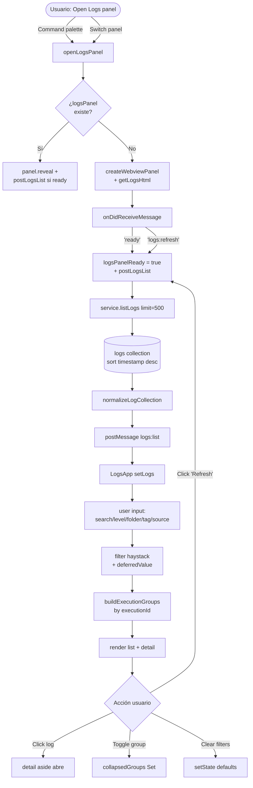

# Logs

Panel webview read-only sobre la colección Mongo `logs`. Normaliza documentos heterogéneos a una forma común (`LogRecord`), agrupa por `executionId` cuando existe, y ofrece filtros + búsqueda + detalle estructurado.

## Propósito

Resuelve un problema operativo: los producers (scripts Python, jobs Mongo, MCP server, etc.) escriben logs estructurados a la misma colección, con shapes ligeramente distintos. Sin un visor:

- Tendrías que correr queries Mongo a mano para investigar un fallo.
- No se distingue qué logs pertenecen al mismo "span de ejecución".
- No se ve la jerarquía `class.method` ni la duración agregada.

El Logs panel resuelve esto siendo:

- **Tolerante a esquemas**: cualquier campo no reconocido cae como `detail` con label legible.
- **Consciente de ejecuciones**: agrupa por `executionId` con begin/end/duration calculados.
- **Diagnóstico**: detail panel con todos los campos estructurados, listo para copiar al issue.
- **Filtrable**: level, folder, tag, source + búsqueda full-text sobre el haystack del log.

Es el panel de **observabilidad**. Lo abres cuando algo no funcionó.

## Modelo de datos

`LogRecord` (definido en `apps/vscode-extension/src/logs.ts:7-25`):

| Campo                      | Tipo          | Notas                                                                                                                   |
| -------------------------- | ------------- | ----------------------------------------------------------------------------------------------------------------------- |
| `id`                       | string?       | `_id` Mongo como string. Clave estable cuando existe.                                                                   |
| `timestamp`                | string ISO    | Normalizado desde `Date` o string parseable. Fallback: `1970-01-01`.                                                    |
| `day`                      | string        | `timestamp.slice(0,10)` — no se usa en grouping actual.                                                                 |
| `level`                    | string        | UPPERCASE. `INFO` por defecto si falta.                                                                                 |
| `source`                   | string        | Resuelve a `source ?? logger_name ?? class.method ?? process`. Cae a `"unknown"`.                                       |
| `folder`                   | string        | Inferida desde `source` (splits por `/` o `.`).                                                                         |
| `message`                  | string        | Resuelve a `message ?? title ?? event ?? "No message"`.                                                                 |
| `summary`                  | string        | `<title/tag/event> - <message> (<process/source>)`. Usado en row y haystack.                                            |
| `executionId`              | string?       | Clave de agrupación. Sin esto, va al bucket "ungrouped".                                                                |
| `tag`                      | string?       | `tag ?? event`.                                                                                                         |
| `className` / `methodName` | string?       | Cuando vienen del producer Python.                                                                                      |
| `loggerName`               | string?       | Logger Python original.                                                                                                 |
| `process`                  | string?       | Process / pod / worker.                                                                                                 |
| `event`                    | string?       | Tag tipo `BEGIN/END/READ/INSERT/ERROR`.                                                                                 |
| `title`                    | string?       | Etiqueta corta humana.                                                                                                  |
| `details`                  | `LogDetail[]` | Resto del documento, priorizando `[file, schema, table, periodo, rows, duration_ms, endpoint, status, tipo, test_run]`. |

`LogExecutionGroup` (en `webview/logs/state.ts:3-13`):

| Campo                              | Tipo          | Notas                                                                |
| ---------------------------------- | ------------- | -------------------------------------------------------------------- |
| `id` / `label`                     | string        | `executionId` o `"ungrouped"`.                                       |
| `logs`                             | `LogRecord[]` | Ordenados por timestamp desc (newest first).                         |
| `beginTimestamp` / `endTimestamp?` | string        | Primer log o el que tiene `tag/event === "BEGIN"`.                   |
| `durationMs`                       | number?       | `details.duration_ms` explícito o delta begin→end.                   |
| `classMethod`                      | string        | `<class>.<method>` del log más reciente que tenga estos campos.      |
| `dominantTag`                      | string        | `ERROR` si algún log lo es; sino `WARNING`; sino tag/event/`"INFO"`. |
| `isUngrouped`                      | boolean       | Para estilo CSS especial.                                            |

## Contrato de producer

Documentado en `docs/log-contract.md`. Shape esperado:

```json
{
  "execution_id": "uuid4 or null",
  "timestamp": "UTC datetime",
  "tag": "BEGIN | END | READ | INSERT | ERROR | WARNING | INFO | ...",
  "class": "LoaderClass",
  "method": "method_name",
  "title": "short human label",
  "message": "longer human message",
  "level": "INFO | WARNING | ERROR"
}
```

Python helpers `begin_execution()` / `end_execution()` manejan `execution_id` vía `ContextVar`. Logs sin `execution_id` son válidos y caen al bucket "ungrouped".

## Flujo de uso



## Arquitectura técnica

```mermaid
flowchart LR
    subgraph ExtHost[Extension Host]
        Open[openLogsPanel<br/>extension.ts:388]
        Post[postLogsList<br/>extension.ts:220]
        List[service.listLogs<br/>service.ts:413<br/>limit=500]
        Coll[getLogsCollection<br/>service.ts:623]
        Norm[normalizeLogCollection<br/>logs.ts:44]
    end

    subgraph Mongo[(MongoDB)]
        LogsCol[logs<br/>indexes: source/level/process/<br/>execution_id/tag<br/>+ timestamp desc]
    end

    subgraph WebView[Webview React IIFE]
        App[LogsApp.tsx]
        State[state.ts<br/>buildExecutionGroups<br/>buildLogKey<br/>reconcileSelectedLogKey<br/>getLogsEmptyState]
        List2[logs list panel]
        Det[detail aside]
    end

    Open --> Post
    Post --> List
    List --> Coll
    Coll --> LogsCol
    LogsCol --> Norm
    Norm --> Post
    Post -->|postMessage logs:list| App
    App --> State
    App --> List2
    App --> Det
    App -->|postMessage logs:refresh| Post
```

**Puntos clave del flujo de datos**:

- `service.listLogs(limit = 500)` — el límite es **hardcoded en el parámetro default** (`service.ts:413`). No hay setting expuesto.
- Sort: `{ timestamp: -1 }` server-side; el normalizer mantiene el orden (`logs.ts:54`).
- Índices Mongo: `source/timestamp`, `level/timestamp`, `process/timestamp`, `execution_id/timestamp`, `tag/timestamp` — todos con partial filter cuando el campo es opcional (`service.ts:610-616`).
- El normalizer **NUNCA tira** un documento por estar incompleto: rellena con defaults razonables.
- El webview hace ALL grouping/filtering **en cliente**. El extension host solo entrega `LogRecord[]` raw.

## Fortalezas

1. **Normalización defensiva** (`logs.ts:57`). Cualquier shape de documento se convierte en `LogRecord` consistente. Producers heterogéneos no rompen el panel.
2. **Detalles priorizados** (`PRIORITY_DETAIL_KEYS` en `logs.ts:42`). Los campos comunes (`file`, `schema`, `table`, `duration_ms`, `endpoint`, `status`, …) aparecen primero en el detail panel. Mejora la lectura sin que cada producer tenga que ordenar nada.
3. **Agrupación por ejecución**. `buildExecutionGroups` (`state.ts:19`) agrupa por `executionId` con begin/end/duration calculados. Es lo que convierte el panel en "tracer" útil para procesos largos.
4. **DominantTag por grupo** (`state.ts:92`): ERROR > WARNING > tag más común. De un vistazo ves si el grupo terminó mal.
5. **Empty states diferenciados** (`state.ts:59`): `empty` (no hay logs) vs `filtered` (filtros ocultan todo) — con botón "Clear filters" en el segundo caso.
6. **`useDeferredValue(search)`** (`LogsApp.tsx:32`). Evita re-render por tecla durante búsqueda; usa el valor diferido para el filtro.
7. **Índices Mongo correctos**. Partial filter expressions para campos opcionales (`process`, `execution_id`, `tag`) — no infla índices con documentos que no tienen el campo.
8. **CSP estricta** + nonce (`getHtml.ts`). Igual que Graph.
9. **Tests del state** (`LogsApp.test.ts`, 79 líneas). El único panel con tests del lado webview además de Drawer.
10. **`duration_ms` explícito gana** sobre cálculo timestamp delta (`state.ts:102`). Si el producer mide la duración con tiempo de CPU real, se respeta.

## Debilidades y problemas detectados

### Bugs y comportamientos confusos

1. **`source` dropdown duplica el valor** (`LogsApp.tsx:184-191`). Renderiza `{option === "all" ? "All sources" : option}` seguido de `{option !== "all" ? option : null}` — el segundo span queda sin sentido y repite el value como texto fantasma dentro del `<option>`. Bug visual menor.
2. **Bucket "ungrouped" mezcla "sin executionId" con "sin tag/event"**. En el dropdown de tag, `"untagged"` aparece como opción que filtra todos los logs sin tag (sea cual sea su grupo). Comportamiento confuso porque suena a una categoría real.
3. **El detail se reabre con `filteredLogs[0]`** cuando el seleccionado deja de matchear el filtro (`LogsApp.tsx:107`). El usuario ve "salta" el panel a un log distinto sin haber clickeado. No es bug funcional pero rompe expectativa.
4. **`reconcileSelectedLogKey` colapsa a `null`** cuando no hay logs (`state.ts:52`) — bien — pero `setDetailOpen(false)` se ejecuta cada vez que llega un array vacío (`LogsApp.tsx:49`), reseteando la preferencia del usuario.

### UX

5. **Sin auto-refresh**. Un panel operativo que no se actualiza solo obliga a click manual cada vez. Para logs en vivo es restrictivo. Devin propuso change streams; basta con polling cada 10s mientras el panel esté visible.
6. **Sin filtro por rango de tiempo**. No hay "última hora / 24h / 7d". El usuario solo ve la "ventana" de los 500 más recientes sin control.
7. **No hay quick action "solo errores"**. Cambiar `level=ERROR` requiere 2 clicks en el dropdown.
8. **Sin contadores por nivel** en el toolbar. Útil tener `ERROR 12 · WARNING 30 · INFO 458` para reconocer rápido si hay errores.
9. **Sin agrupación por día**. `day` se calcula en el normalizer pero `buildExecutionGroups` solo agrupa por executionId. Si hay logs viejos sin `executionId`, todos caen al mismo bucket "ungrouped" sin distinción temporal.
10. **Sin sticky header/toolbar**. Al hacer scroll, los filtros desaparecen — peor cuanto más larga la lista.
11. **Sin highlight del término buscado** en row ni detail. Hay que escanear visualmente.
12. **Sin copy-to-clipboard** del `executionId`, de un `LogDetail.value`, o del JSON completo del log. Para llevarlo a un issue es manual.
13. **Sin link entre log y task**. Si un log tiene `details.task_code` o el `executionId` apunta a una tarea, no hay botón "Open task in graph".
14. **El panel no muestra a qué `mongoLogsCollection` está apuntando**. El toolbar dice "Mongo collection" genérico. Útil para multi-DB debug.
15. **El detail panel siempre ocupa ~40% del ancho** si está abierto. Sin grip de resize ni opción de "modo lista compacta".

### Lógica

16. **Límite hardcoded a 500** (`service.ts:413`). No se puede configurar desde setting ni desde el webview. Para sesiones largas o producers chatty (cada 200ms), 500 logs cubren ~2 minutos.
17. **Sin paginación / infinite scroll**. Solo hay "Refresh" que vuelve a tomar los 500 más recientes. No hay "show older".
18. **Re-fetch completo en cada refresh**. No se aprovecha `_id` o `timestamp` como cursor incremental.
19. **`buildExecutionGroups` corre sobre `filteredLogs`** (`LogsApp.tsx:103`), no sobre `logs`. Esto significa que filtrar por level=ERROR rompe la agrupación de un span que tenía mixed levels. Tradeoff intencional pero a veces confunde: un grupo ERROR aparece "solitario" porque sus logs INFO se filtraron.
20. **`buildLogKey` fallback** (`state.ts:16`): si no hay `id`, usa `${timestamp}:${source}:${level}:${summary}`. Si dos logs idénticos llegan en el mismo ms, colisionan. Raro pero posible.
21. **Sort por timestamp solo a nivel Mongo y normalizer**. La UI no permite cambiarlo (por level, por duration, por source).

### Proceso / publicación

22. **Sin onboarding del panel vacío explicando el contrato**. Hoy dice "No logs available... Refresh the panel or verify the extension is pointed at the expected Mongo database." Podría linkear al `log-contract.md` y mostrar un snippet Python mínimo.
23. **`log-contract.md` está solo en inglés** y dentro de `docs/`. No se enlaza desde el panel ni desde el README.
24. **Sin export CSV/JSON** de los logs visibles (filtrados). Útil para llevar al ticket.
25. **Sin telemetría del panel**. `recordInteraction` no se invoca al abrir/refrescar. Difícil saber si se usa.

## Mejoras propuestas

### Técnicas

- **Setting `cortex.logsLimit`** con default 500, expuesto en el webview con un input `min/max`. Permitir 100/500/2000/5000.
- **Polling opcional** (toggle en toolbar): cada N segundos, refrescar mientras el panel esté visible. `cortex.logsAutoRefreshSeconds` con default 0 (off).
- **Paginación con cursor `timestamp`**: botón "Load older" que pide `{ timestamp: { $lt: lastTimestamp } }`, limit=500.
- **Stream incremental** (siguiente paso): MongoDB Change Streams en el extension host. Costo: requiere Mongo replica set (Atlas lo tiene; local Mongo single node no). Documentar el tradeoff.
- **Cache de `buildExecutionGroups`** por hash de `filteredLogs.map(_.id).join("|")`. Hoy se recalcula con cada keystroke en search.
- **Export CSV/JSON** del array `filteredLogs` actual.

### Visuales

- **Contadores por nivel** en el toolbar: `ERROR 12 · WARNING 30 · INFO 458` (sobre `filteredLogs`).
- **Quick chips de filtro**: `Errors`, `Warnings`, `Last hour`, `Last 24h`. Click = aplica filtro; click otra vez = limpia.
- **Highlight del término buscado** en row summary y detail message.
- **Copy-to-clipboard** botones: en cada `LogDetail`, en el `executionId`, y un "Copy as JSON" en el header del detail.
- **Sticky toolbar** con `position: sticky; top: 0`. Trivial.
- **Resize del detail panel** (drag handle) o toggle "compact list mode".
- **Mostrar la collection actual** en el subtitle: `Mongo collection: cortex.logs`.
- **Indicador visual del grupo "abierto" sin END**: hoy hay chip `"open"`, pero podría ser amber para distinguir de un grupo cerrado.

### Lógicas

- **Agrupación adicional por día** dentro del grupo "ungrouped". `buildExecutionGroups` debe sub-agrupar logs sin executionId por `day` para no hacer una sola masa.
- **Filtros aplican antes y después de grouping**: opción "preservar grupos completos" — si un grupo tiene al menos un log que matchea el filtro, mostrar todo el grupo (con contexto).
- **Sort secundario por level**: dentro de un grupo, ERROR > WARNING > INFO. Hoy solo es timestamp asc dentro del grupo.
- **Link log → task**: si `details.task_code` o `tag` matchea una tarea conocida, mostrar botón "Open in graph" que invoca `cortex.openGraph?<code>`.
- **Resaltar el ejecution más reciente** con borde acento. Hoy todos los grupos tienen mismo peso visual.

### Proceso / uso

- **Onboarding del panel vacío** con snippet Python y link al contrato:
  ```python
  from cortex_logs import begin_execution, log, end_execution
  exec_id = begin_execution("MyLoader", "run")
  log("INFO", "title", "message", tag="READ", file="...")
  end_execution(exec_id, status="OK")
  ```
- **Traducir `docs/log-contract.md` a español** (sigue la convención del repo).
- **`recordInteraction("logs_open", { logCount, hasErrors })`** en `postLogsList`. Útil para saber si la gente usa el panel.
- **Test de `normalizeLogDocument`** con fixtures de producers reales (Python, MCP). Hoy `LogsApp.test.ts` cubre state helpers pero no el normalizer.

## Próximos pasos sugeridos (orden propuesto)

1. **Fix dropdown `source` con value duplicado** — 5 min.
2. **Setting `cortex.logsLimit` + quick chips de tiempo** — 1h, mucho valor por bajo costo.
3. **Contadores por nivel + highlight de búsqueda** — 1h. Mejora drástica de lectura.
4. **Auto-refresh por polling** detrás de setting opt-in — 1h. Ahorra clicks diarios.
5. **Copy-to-clipboard** en detail y `executionId` — 30 min.
6. **Onboarding del panel vacío con snippet Python** — 30 min.
7. **Agrupación por día en bucket "ungrouped"** — 1h.
8. **Paginación con cursor `timestamp`** — 2h.
9. **Export CSV/JSON** — 30 min.
10. (Largo plazo) Change Streams cuando el target sea Atlas/replica set.

## Change Streams (siguiente paso)

Implementado en `apps/vscode-extension/src/extension.ts:616-637` como alternativa al polling.

### Activación

- Setting `cortex.logsChangeStreams` (boolean, default `false`).
- Al abrir el panel, si está habilitado, se llama a `service.getLogsSource().subscribe(onAppend)`.
- Si `subscribe` devuelve un cleanup function, se detiene el polling (`stopLogsPoll()`).
- Si devuelve `null` (Mongo single-node, error de permisos, etc.), se cae a polling como fallback.

### `MongoLogsSource.subscribe` (`mongoLogsSource.ts:39-60`)

```typescript
async subscribe(onAppend: LogsAppendCallback): Promise<(() => Promise<void>) | null>
```

- Retorna `null` inmediatamente si `changeStreamsEnabled` es `false`.
- Abre `collection.watch([{ $match: { operationType: "insert" } }], { fullDocument: "updateLookup" })`.
- Por cada evento `change`, normaliza el `fullDocument` y lo envía vía `onAppend`.
- Errores del stream se loguean (no detienen el stream).
- Si `watch()` lanza (ej. single-node), captura, loguea, retorna `null`.

### `FileLogsSource.subscribe`

No implementado (`undefined`). La fuente file usa solo polling.

### Cache key

En `service.ts`, la factory usa `${kind}:${path}:cs=${changeStreamsEnabled}` como cache key para que cambiar el setting invalide la fuente cacheada.

### Config watcher

Cuando cambia `cortex.logsChangeStreams`, se llama a `setupLogsChangeStream()` para re-suscribir (o limpiar y volver a polling) y luego `postLogsList()` para refrescar.

### Disposal

Al cerrar el panel (`onDidDispose`), si hay `logsChangeStreamCleanup`, se ejecuta y se setea a `null`.

### Tests

- `mongoLogsSource.test.ts` — 5 tests: disabled, enabled+OK, enabled+error, insert event, non-insert event.
- `extension.test.ts` — 4 tests: cleanup on dispose, subscribe null no-op, config change re-suscribes, append event posts message.

## Tests existentes

- `apps/vscode-extension/src/webview/logs/LogsApp.test.ts` (79 líneas) — cubre `state.ts`: `buildExecutionGroups`, `buildLogKey`, `coerceLogFilterValue`, `reconcileSelectedLogKey`, `getLogsEmptyState`.

**Gaps**:

- Sin tests para `normalizeLogDocument` (la lógica más densa del módulo, `logs.ts:57`).
- Sin tests de `LogsApp.tsx` (render + filtros + grouping).
- Sin fixtures de producers reales (Python output, MCP output) para garantizar que cambios no rompen consumers.
- Sin test de `service.listLogs` con un Mongo stub.
