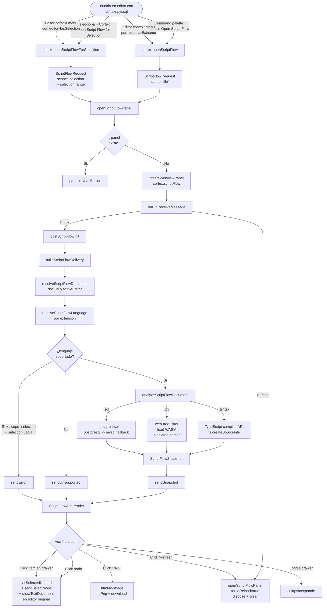
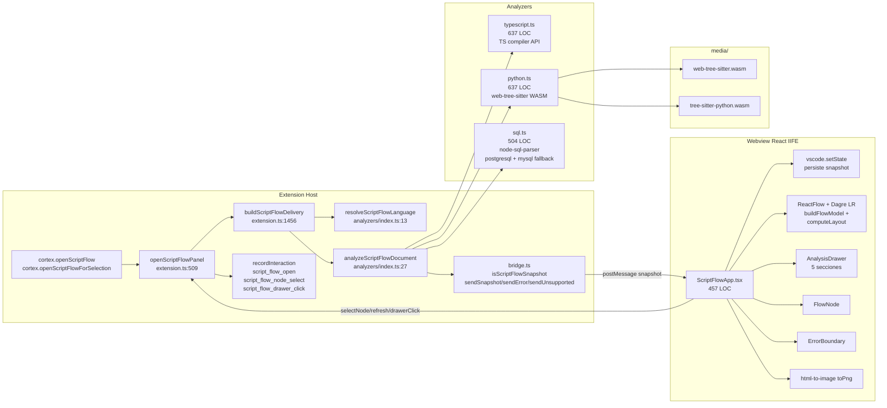

# Script Flow

Panel webview que analiza un único archivo de código (TypeScript, Python o SQL) y renderiza su control flow como grafo, con drawer de análisis (entry points, decisiones, loops, observaciones). Click en un nodo revela el rango correspondiente en el editor.

Tres analyzers en el extension host (`scriptFlow/analyzers/`):

- **TypeScript** (`typescript.ts`, 637 líneas) — TypeScript compiler API.
- **Python** (`python.ts`, 637 líneas) — `web-tree-sitter` con WASM bundles.
- **SQL** (`sql.ts`, 504 líneas) — `node-sql-parser` con PostgreSQL → MySQL fallback.

## Propósito

Resuelve un problema de comprensión de código puntual: cuando abres un archivo de 500+ líneas que no escribiste tú, **leer top-to-bottom no escala**. Quieres:

- Ver los entry points de un vistazo.
- Identificar las decisiones (ifs con `n` ramas) y los loops sin recorrer el archivo.
- Centrar el editor en una rama específica clickeando un nodo del grafo.
- Una observación rápida del estilo "no hay function flow detectado" si el archivo no es estructural.

A diferencia de [[graph]] (planes/tareas) o [[brain]] (documentación), Script Flow es **un análisis estructural del código fuente del momento**. Es el panel de **lectura activa**: lo abres cuando vas a entender un archivo, no a navegarlo.

## Modelo de datos

`ScriptFlowSnapshot` (`apps/vscode-extension/src/scriptFlow/types.ts:57-62`):

| Campo               | Tipo                          | Notas                                                           |
| ------------------- | ----------------------------- | --------------------------------------------------------------- |
| `metadata.path`     | string                        | Ruta del archivo (normalizada a `/`).                           |
| `metadata.language` | `typescript \| python \| sql` | Detectado por extensión.                                        |
| `metadata.hash`     | string                        | sha1 del source. Útil para diff/cache (hoy no se usa).          |
| `metadata.parsedAt` | string ISO                    | Cuándo se generó el snapshot.                                   |
| `nodes`             | `ScriptFlowNode[]`            | Ver kinds más abajo.                                            |
| `edges`             | `ScriptFlowEdge[]`            | `from`, `to`, `kind`, `label?`.                                 |
| `analysis`          | `ScriptFlowAnalysis`          | `entryPoints`, `summary`, `decisions`, `loops`, `observations`. |

**11 tipos de nodo** (`types.ts:4-16`):

- `entry` — archivo / scope inicial.
- `function` — definición de función/método.
- `branch` — `if`/`switch`/`match`/`case` etc.
- `loop` — `for`/`while`/comprehensions.
- `tryCatch` — bloque try (sin distinguir catch/finally).
- `return` — sentencia de retorno.
- `call` — invocación a otra función.
- `cte` — Common Table Expression (SQL `WITH`).
- `select` — SELECT statement.
- `join` — JOIN clause.
- `subquery` — subconsulta.

**3 tipos de edge** (`types.ts:19`):

- `flow` — control flow normal.
- `call` — invocación de función.
- `dataflow` — flujo de datos (usado en SQL).

`ScriptFlowAnalysis`:

| Campo          | Tipo                          | Notas                                  |
| -------------- | ----------------------------- | -------------------------------------- |
| `entryPoints`  | string[]                      | IDs de nodos marcados como entradas.   |
| `summary`      | string                        | Texto descriptivo multi-línea.         |
| `decisions`    | `{nodeId, label, branches}[]` | Branch nodes con conteo de ramas.      |
| `loops`        | `{nodeId, label, kind}[]`     | Loops con su tipo (`for`/`while`/...). |
| `observations` | string[]                      | Notas detectadas durante el análisis.  |

## Runtime traces

Script Flow Live no debe ejecutar scripts desde la extensión. La capa runtime se diseña como evidencia externa en `.scriptflow.trace.jsonl`: procesos locales, wrappers, runners, proxies DB o agentes remotos escriben eventos JSONL versionados, y la extensión solo los lee y los cruza contra `node_id`.

Hay helpers opt-in para prototipos TypeScript y Python:

- `apps/vscode-extension/src/scriptFlow/instrumentation/typescriptTrace.ts`
- `apps/vscode-extension/fixtures/script-flow/instrumentation/scriptflow_trace.py`

Ver especificación completa: [`docs/modules/script-flow-runtime-trace.md`](./script-flow-runtime-trace.md).

Ver guía QA/manual: [`docs/modules/script-flow-live-qa.md`](./script-flow-live-qa.md).

## Flujo de uso

## Arquitectura técnica

**Puntos clave del flujo de datos**:

- **Parsing en el extension host**, no en el webview. El webview solo renderiza el snapshot ya estructurado.
- **Python WASM bundles** (`media/web-tree-sitter.wasm` + `media/tree-sitter-python.wasm`) son requeridos por la build. Si faltan, el analyzer falla en `getPythonParser()` con error claro pero no degrada (`python.ts:61-66`).
- **Parser Python es singleton** con promise cache (`python.ts:44-54`). Una sola carga por sesión.
- **SQL fallback de dialecto**: intenta `postgresql` primero; si falla, `mysql`. Si ambos fallan, mensaje compuesto con los dos errores (`sql.ts:50-74`).
- **Refresh = dispose + crear panel** (`extension.ts:548-550`). No es soft refresh: el viewport, zoom y drawer state se pierden.
- **`vscode.setState`** persiste el último snapshot completo en el webview state. Reload sin nuevo análisis recupera el último visto.

## Fortalezas

1. **3 lenguajes con strategy pattern claro** (`analyzers/index.ts`). Cada analyzer es independiente, fácil agregar otro (rust, go, java) si se quiere.
2. **TypeScript usa compiler API nativo**, no regex. Maneja TSX vía `ts.ScriptKind.TSX` (`typescript.ts:53`).
3. **Python con tree-sitter** (WASM). Parser real, no heurística. Maneja toda la sintaxis Python moderna.
4. **SQL con dialecto fallback**. Intenta dos dialectos en orden antes de fallar.
5. **Hash sha1 del source** ya está calculado (`typescript.ts:75`) — base para cache trivial.
6. **`isScriptFlowSnapshot` valida toda la forma del payload** (`types.ts:76-104`) — chequea metadata, nodes con kind válido, edges con kind válido, analysis con arrays. Defensa robusta contra payloads corruptos.
7. **Drawer con 5 secciones específicas** (Resumen, Entry points, Decisiones, Loops, Observaciones) — granularidad útil para lectura activa.
8. **Click en nodo revela en editor** con range exacto (`extension.ts:570-575`). Buena navegación bidireccional.
9. **PNG export** funcional con `html-to-image` (`ScriptFlowApp.tsx:408-428`). Único panel con esta capacidad.
10. **Telemetría granular**: `script_flow_open` (language, nodeCount, edgeCount, parseMs), `script_flow_drawer_click` (section), `script_flow_node_select` (kind). Tres puntos de medición.
11. **Edges animadas para `loop`** (`ScriptFlowApp.tsx:348`). Affordance visual rica, consistente con [[graph]].
12. **Responsive**: `<800px` colapsa drawer automáticamente (`ScriptFlowApp.tsx:114-124`). Único panel con esto.
13. **`ErrorBoundary`** envuelve el panel — captura errores del webview sin matar el panel entero.
14. **`vscode.setState`** persiste para reload sin reparsear.
15. **MiniMap con color por kind** (`ScriptFlowApp.tsx:201`). Útil en archivos grandes.

## Debilidades y problemas detectados

### Limitaciones de cobertura (críticas para marketplace)

1. **Single-file only**. No resuelve imports ni construye grafo cross-file. El [[graph]] de Cortex tampoco lo hace pero ese es de tareas, no código. Para "entender un módulo", el archivo solo es la mitad. El README lo menciona pero el panel no tiene aviso.
2. **SQL solo single SELECT statement** (`sql.ts:79-81`). Multi-statement scripts (`CREATE TABLE...; INSERT...; SELECT...;`) tiran error inmediato. Este es el caso real más común en SQL — el panel falla en 80% de archivos `.sql` reales.
3. **`.js`/`.jsx` no soportados**. Solo `.ts/.tsx`. Sería trivial agregar (`ts.ScriptKind.JS / JSX`).
4. **Python requiere WASM bundles** en `media/`. Build no-trivial y dependencia frágil. Si esos `.wasm` no están en el `.vsix` packageado, Python rompe con error críptico.
5. **TypeScript sin tsconfig del workspace**. `ts.createSourceFile(..., ts.ScriptTarget.Latest, true, ...)` ignora compilerOptions reales. Decoradores experimentales, paths aliases, JSX pragma custom — todo falla.
6. **No usa el LSP de VS Code**. Para TypeScript, `vscode.executeDefinitionProvider` ya conoce el grafo de tipos del proyecto. Script Flow lo reparsea desde cero ignorando esa info.

### Bugs y comportamientos confusos

7. **Refresh = dispose + create** (`extension.ts:548-550`). Click "Refresh" tira viewport, zoom, drawer collapse, y posición del scroll. Para iteración rápida ("ver cambio, refresh, ver cambio") es frustrante.
8. **Refresh usa `pendingScriptFlowRequest`** sin revalidar la selección. Si seleccionaste líneas 10-20 antes de editar, las líneas 10-20 después del edit son contenido distinto. Refresh muestra ese contenido nuevo sin avisar.
9. **`resolveScriptFlowDocument` fallback silencioso a active editor** (`extension.ts:1506-1516`). Si abre URI A pero falla por path inválido, muestra el archivo activo (B). El usuario pidió A y ve B sin entender por qué.
10. **`metadata.path` es siempre el path completo** aunque scope sea "selection". El `hash` también del source completo del documento (no de la selección). Si después se agrega cache, va a confundir file vs selection.
11. **TS analyzer marca observación "No top-level function flow"** (`typescript.ts:97-99`) cuando hay `>1` node y `0` functions. Pero `entry` cuenta como node — si el file tiene solo statements top-level (un script), la observation aparece confusamente.
12. **`script_flow_drawer_click` `section` es string libre** (`bridge.ts:11`). Cualquier valor llega a telemetría. El tipo en el frontend lo restringe pero el host no valida.
13. **`tryCatch` es un único nodo** sin distinguir `try` / `catch` / `finally`. Para revisión de error handling, esto pierde información clave (¿qué se captura?, ¿hay finally?).
14. **Sin distinción sync/async**. `async function` y `function` se ven idéntico en el grafo.
15. **No detecta `export default` ni `export { x }`**. Para entender qué expone el archivo, el grafo no ayuda.

### UX

16. **Sin búsqueda dentro del flow**. Archivo con 80 nodos: encontrar `loadUser` requiere scroll y vista a ojo.
17. **`computeLayout` siempre LR**. No hay toggle TB. Para archivos con funciones largas verticales, TB rinde más.
18. **PNG export no incluye el drawer** (`ScriptFlowApp.tsx:409`). Para llevar a un issue el flow + el summary, son 2 capturas.
19. **Sin SVG export**. `html-to-image` soporta `toSvg`, sería trivial agregar.
20. **PNG export usa `pixelRatio: 2`** hardcoded. Sin selector de resolución.
21. **Sin documentación de los kinds**. Para alguien nuevo, qué significa `cte`, `dataflow`, `call` vs `flow` no es obvio.
22. **Summary del analyzer es texto estático**. Buena UX inicial pero no actualiza tras drill-down o cambio de selección. Solo refleja el snapshot completo.
23. **`observations` sin formato**. Si el analyzer pone enlaces o paths, son texto plano.
24. **Sin link entre Script Flow y Task/Notes**. Detectaste un bug analizando: no hay "Create task here" o "Add note".
25. **Sin "find broken paths"** en el grafo. Si una rama termina sin return ni call, no se reporta.
26. **Sin export del análisis a markdown**. Solo PNG visual.

### Lógica / performance

27. **Sin caché por hash**. Reabrir el panel del mismo archivo re-parsea. Para archivos de 3000+ líneas en TypeScript es perceptible.
28. **Sin debounce de refresh**. Múltiples clicks en Refresh = múltiples dispose+create.
29. **Python parser singleton sin reset**. Si por alguna razón el parser queda en estado raro, no hay forma de re-inicializarlo sin reload de extensión.
30. **`buildFlowModel` corre en cada cambio de `selectedNodeId`** (`ScriptFlowApp.tsx:89-95`). Recalcula Dagre completo solo para refrescar el `selected` flag. Costoso para grafos grandes.
31. **`selectedNodeId` se resetea al recibir snapshot nuevo** (`ScriptFlowApp.tsx:134`) — la prefiere a `entryPoints[0]`. Útil pero para iteración "edit-refresh" pierde foco.

### Proceso / publicación

32. **Sin tests de los analyzers**. Tres archivos de ~500-600 líneas cada uno, sin un solo `.test.ts`. El módulo con más LOC del repo es el menos cubierto.
33. **Sin fixtures**. Archivos `.ts`/`.py`/`.sql` de referencia para regresiones.
34. **`media/*.wasm` no se mencionan en `files` de package.json explícitamente**. Si la build cambia, podrían no entrar al `.vsix`.
35. **Sin documentación de los kinds**. Faltaría un `docs/script-flow-glossary.md` o sección en este mismo doc.

## Mejoras propuestas

### Técnicas

- **Cache por `metadata.hash`**: el sha1 del source ya se calcula (`typescript.ts:75`). Memoizar `Map<hash, Snapshot>` ahorra reparsing. Invalidación trivial: hash cambia = re-parsea.
- **Soportar `.js`/`.jsx`** en TS analyzer: cambiar el `ScriptKind` por extensión (`js`, `jsx`, `ts`, `tsx`). 4 líneas.
- **Soportar multi-statement SQL**: cambiar `unwrapSelectAst` para producir un grafo con N entry points (uno por statement) o para procesar el primer SELECT con prefix-context de los previos. Hoy falla todo si hay más de uno.
- **Detectar tsconfig del workspace** y pasarlo a `createSourceFile`. Mejora coverage para decoradores, JSX pragma.
- **Soft refresh**: en lugar de `forceReload: true`, re-postear `postScriptFlowInit` al mismo panel manteniendo viewport. Conserva UX de iteración.
- **Validar path en `resolveScriptFlowDocument`** sin fallback silencioso. Mostrar error específico cuando la URI no abre.
- **Reset del Python parser**: comando `cortex.scriptFlow.resetPythonParser` para recuperar de estado corrupto sin reload.
- **`tryCatch` con sub-nodos** `try`, `catch`, `finally` separados.
- **Async marker** en nodos `function`: `async` flag en `meta` + indicador visual.

### Visuales

- **Toggle LR/TB** en el toolbar.
- **Búsqueda dentro del grafo**: `Ctrl+K` que filtra/centra nodes por label.
- **SVG export** además de PNG. `toSvg` de `html-to-image`.
- **"Export full report"** (PNG + summary + observations) como ZIP o markdown.
- **Indicador async/sync** en `FlowNode`.
- **Mini-glosario de kinds**: link en el toolbar a una vista de leyenda con cada kind y un icono.
- **Color de borde por kind** (no solo color de fondo), para grafos con muchos nodos.
- **Highlight permanente del seleccionado en el editor** (decorations API) mientras el panel está abierto.

### Lógicas

- **`script_flow_drawer_click` con union type estricto** en `bridge.ts` (no `string` libre).
- **Distinción sync/async** en TS analyzer (`isAsyncFunction`).
- **Export markdown** del análisis: `## Resumen\n...\n## Entry points\n- foo\n- bar` etc.
- **Detección de exportaciones** en TS analyzer: nodos `export` separados marcando lo que el módulo expone.
- **Detección de "función sin return"** y "rama sin return" como observation.
- **Link a Task/Note**: botón "Create task from this function" pre-rellena `cortex.editTask` con `code = funcName`, `prompt = node.range.code`.

### Proceso / uso

- **Tests por analyzer** con fixtures `.ts`/`.py`/`.sql` mínimos en `__fixtures__`. Verificar: nodes count, edges count, entryPoints, decisions count, loops count, summary contiene X.
- **Test del bridge** (`isScriptFlowSnapshot` con fixtures corruptos: faltan campos, kind inválido, etc.).
- **Test del flujo "Refresh tras editar"** — actualmente ningún test cubre que el contenido del archivo cambia.
- **Garantizar `*.wasm` en `files` de `package.json`**: explícitamente `"media/*.wasm"`.
- **Documento `docs/script-flow-kinds.md`** con tabla de los 11 kinds + 3 edges con ejemplos visuales.

## Próximos pasos sugeridos (orden propuesto)

1. **Soportar `.js`/`.jsx` en TS analyzer** — 5 minutos, amplía el target audience del marketplace.
2. **Multi-statement SQL** — 1-2h, desbloquea 80% de archivos `.sql` reales.
3. **Soft refresh** (no dispose) — 30 min, UX clara.
4. **Cache por hash** — 30 min, ganancia tangible en archivos grandes.
5. **Tests por analyzer con fixtures** — 3-4h. Indispensable antes de marketplace dado el LOC.
6. **`*.wasm` en `package.json files`** — 5 min, evita bug futuro.
7. **Toggle LR/TB + búsqueda Ctrl+K** — 1h.
8. **`tryCatch` con sub-nodos + sync/async distinction** — 1-2h. Aumenta el valor analítico.
9. **Validar path en `resolveScriptFlowDocument`** sin fallback silencioso — 15 min.
10. **Documento `docs/script-flow-kinds.md`** — 1h. Antes de marketplace.
11. (Avanzado) Cross-file imports usando `vscode.executeDefinitionProvider` — 1-2 días. Cambio de scope grande.

## Tests existentes

- `apps/vscode-extension/src/webview/script-flow/components/ErrorBoundary.tsx` existe pero no hay test.
- **Ningún test** de `typescript.ts`, `python.ts`, `sql.ts`, `analyzers/index.ts`, `bridge.ts`, `ScriptFlowApp.tsx`, `AnalysisDrawer.tsx`, `FlowNode.tsx`.

**Esto convierte a Script Flow en el módulo con peor relación LOC-vs-tests del repo**: ~2.500 LOC sin un solo test directo.

Brechas críticas:

- Sin verificación de regresión por lenguaje.
- Sin fixture de SQL multi-statement (que hoy rompe).
- Sin fixture de `.tsx` con JSX.
- Sin fixture de Python con sintaxis moderna (`match/case`, walrus, type aliases).
- Sin test de "selection vacía con scope=selection".
- Sin test de error path por wasm faltante.

Antes de publicar, esto es la mayor prioridad de cobertura del repo entero.
