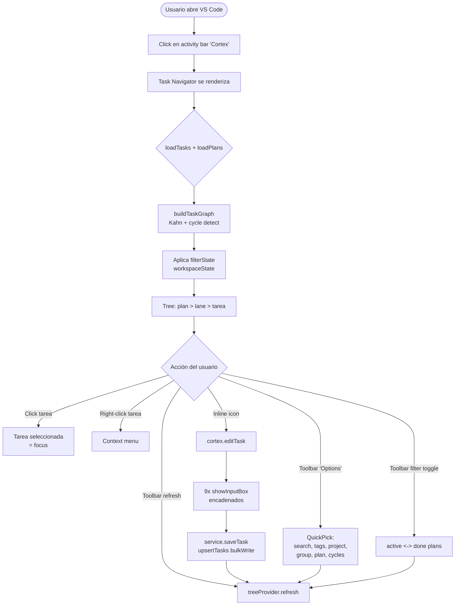
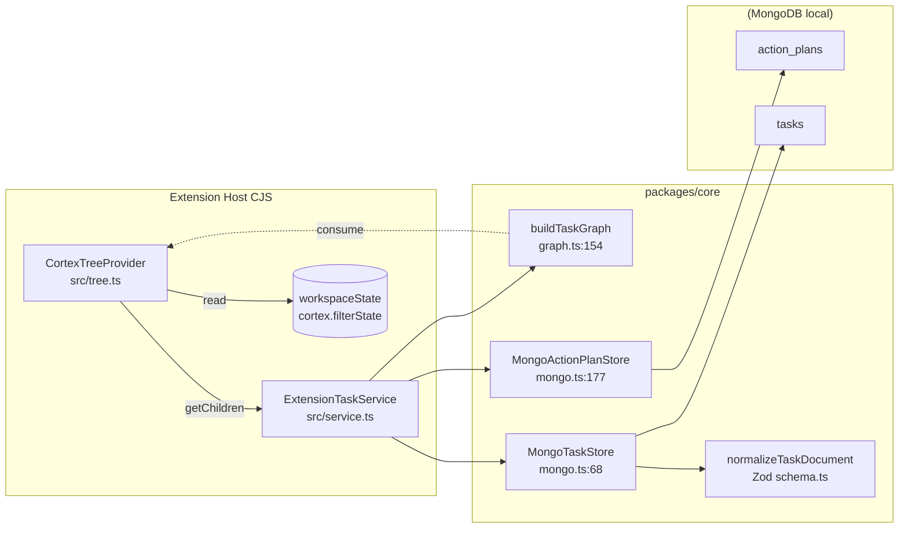

# Task Navigator

Módulo central de Cortex: árbol jerárquico de tareas en el sidebar de VS Code, agrupadas por plan y por lane (swimlane), con filtros persistidos, detección de ciclos y edición rápida.

## Propósito

Resuelve un problema concreto: cuando un refactor o iniciativa tiene **15–80 tareas con dependencias cruzadas**, el listado plano no alcanza. El sidebar de Cortex:

- Agrupa visualmente por **plan → lane → tarea**, ordenado por `orderHint`.
- Marca qué tareas están `ready` (sin bloqueadores pendientes) sin que el usuario tenga que recorrer el grafo a ojo.
- Filtra por proyecto, grupo, tags, búsqueda libre y estado del plan (`active` vs `done`).
- Sirve como **superficie de entrada** al resto de paneles: desde una tarea seleccionada se abre el Graph (PERT), se edita el documento, o se navega al `sourceRef`.

Es el panel que se usa **a diario** mientras los demás son consulta puntual.

## Modelo de datos

`TaskRecord` (definido en `packages/core/src/types.ts:78-99`):

| Campo                                  | Tipo                                                  | Notas                                                                          |
| -------------------------------------- | ----------------------------------------------------- | ------------------------------------------------------------------------------ |
| `code`                                 | string                                                | Identificador único humano (ej. `S2.1`). Usado como PK lógica.                 |
| `project`                              | string?                                               | Proyecto al que pertenece. Filtrable.                                          |
| `shortTask`                            | string                                                | Título corto. Aparece en el tree label.                                        |
| `detail`                               | string                                                | Descripción larga.                                                             |
| `status`                               | `PENDING \| IN_PROGRESS \| BLOCKED \| DONE \| FAILED` | 5 estados (`types.ts:1`).                                                      |
| `agent`                                | string                                                | Quién la ejecuta (humano o LLM).                                               |
| `severity`                             | `LOW \| MEDIUM \| HIGH \| CRITICAL`                   | 4 niveles.                                                                     |
| `tags`                                 | string[]                                              | Filtrable.                                                                     |
| `dependsOn`                            | string[]                                              | Códigos de tareas predecesoras. Soporte de ciclos detectados.                  |
| `durationEstimate`                     | number?                                               | Horas. Habilita ruta crítica si todas las tareas tienen estimación.            |
| `lane`                                 | string?                                               | Swimlane / grupo dentro de un plan.                                            |
| `orderHint`                            | number?                                               | Orden estable dentro de la lane.                                               |
| `sourceRef`                            | string?                                               | Apuntador a archivo o issue externo.                                           |
| `planCode`                             | string?                                               | Plan al que pertenece (ver `ActionPlanRecord`).                                |
| `prompt` / `acceptance` / `outOfScope` | string?                                               | Contrato de la tarea para automatización. **No visibles en el editor actual.** |
| `createdAt` / `updatedAt`              | string ISO                                            | Auditoría.                                                                     |

## Flujo de uso

## Arquitectura técnica

**Puntos clave del flujo de datos**:

- `getChildren()` (`tree.ts:60`) ejecuta `loadTasks + loadPlans + buildTaskGraph` **en cada expansión de nodo**. Hoy es barato porque el sharedClient evita handshakes, pero recalcula el grafo completo desde cero cada vez.
- El filtro vive en `workspaceState` con merge defensivo contra shapes legacy (`service.ts:115-134`).
- El upsert (`mongo.ts:151-167`) usa `bulkWrite { ordered: false }` con `$set: { ...task }` — no toca campos omitidos del input.
- `EventEmitter.fire()` (`tree.ts:49`) dispara **refresh global** del árbol; no hay invalidación granular por nodo.

## Fortalezas

1. **Grafo puro y testeable**. `buildTaskGraph` (`graph.ts:154`) no toca Mongo: recibe `TaskRecord[]`, devuelve grafo + ciclos + topological order. Es un buen ejemplo del estilo "lógica pura + adaptadores I/O" que el resto del repo podría imitar.
2. **Ciclos detectados con DFS + visiting set** y deduplicados (`graph.ts:69-113`). El topological order se omite si hay ciclos en vez de crashear.
3. **Normalización Zod en la frontera**. `collectValidTasks` filtra documentos malformados sin romper el panel — defensa concreta contra datos legacy.
4. **Filtros persistentes** entre sesiones, con clamp de zoom y arrays validados.
5. **`SharedMongoClient` singleton** abierto en `activate()`. Antes cada operación abría/cerraba conexión: eso ya está resuelto.
6. **Sanitización de filtros huérfanos** (`extension.ts:1170`): si guardaste un filtro de proyecto que ya no existe, se descarta en lugar de devolver lista vacía sin explicación.

## Debilidades y problemas detectados

### Bugs y comportamientos confusos

1. **No se pueden vaciar campos opcionales** desde el editor (`extension.ts:1631-1642`). Si una tarea tiene `lane: "frontend"` y la quiero quitar, dejar el input vacío **no la borra**: la línea `...(lane?.trim() ? { lane: lane.trim() } : {})` omite el campo del payload, por lo que `$set` no lo toca y el valor anterior queda intacto. Lo mismo para `project`, `sourceRef`, `durationEstimate`, `tags`, `dependsOn`. Para borrar hay que ir a la base directo.
2. **`prompt`, `acceptance`, `outOfScope` no son editables** desde el panel. Están en el schema (`types.ts:94-96`) y se muestran en el snapshot del Graph, pero el editor del sidebar los ignora. Para llenarlos hay que seed o editar Mongo a mano.
3. **No hay comando para crear tareas nuevas** desde el sidebar. Solo edit + bootstrap de sample. El flujo "tengo una idea de tarea ya mismo" no existe.
4. **No hay comando para borrar tareas** (sí existe para notas: `cortex.deleteNote`).

### UX

5. **Editor en cadena de 9 `showInputBox` + 2 `showQuickPick` secuenciales** (`extension.ts:1544-1646`). Si te equivocas en el campo 5, no hay vuelta atrás: tienes que cancelar y empezar de cero, perdiendo lo que ya tipeaste. Cualquier extensión seria usa un webview de formulario o `vscode.window.createWebviewPanel` para esto.
6. **No hay accesos directos a "Mark as DONE" / "Block" / "Unblock"**. Cambiar status, incluso solo eso, exige recorrer las 11 prompts del editor.
7. **Descripción densa**: el item del árbol muestra `agent · project · group · ready · severity · duration` (`tree.ts:31-37`). En tareas con valores largos, la mitad queda cortada. No hay forma de configurar qué se ve.
8. **Tooltip MarkdownString** se ve bien al hover pero no soporta links accionables (a graph, a archivo `sourceRef`).
9. **No se ve el progreso del plan**. `ActionPlanRecord.progress` existe (`total/pending/in_progress/blocked/done/failed`) pero el `describePlanGroup` solo muestra `<title> · <count>` (`tree.ts:216-227`).
10. **Sin badges/iconos por status o severity**. Todo es texto. Una tarea CRITICAL en rojo y una DONE en gris cambiarían la lectura de un golpe.

### Lógica

11. **`buildTaskGraph` se ejecuta en cada `getChildren`** (`tree.ts:69`), incluso cuando solo expandes un grupo. El cálculo es O(V+E) pero con 200 tareas y 5 expansiones por sesión empieza a notarse. Solución: cachear el grafo en el provider y solo recalcular cuando `refresh()` se dispara.
12. **`EventEmitter.fire()` siempre es global** (`tree.ts:49`). Cuando editas una tarea, todo el árbol colapsa estado de expansión. VS Code permite firear con el nodo afectado para refresh local.
13. **Filtro de plan status (`active`/`done`) compite con filtro de plan seleccionado**. Si seleccionas un plan DONE y luego cambias a "active", el plan seleccionado deja de verse pero no se limpia: queda en estado fantasma.
14. **`sanitizeFilterState`** corre dentro de `postSnapshot` (`extension.ts:1170`) pero no en el path del tree. Si tienes un filtro fantasma, el tree lo aplica igual y devuelve lista vacía sin avisar.

### Proceso / publicación

15. **`cortex.editTask` no aparece en command palette útil** para el usuario nuevo: requiere selección previa y mensajes como "Select a task first" que confunden. No hay onboarding.
16. **El editor no valida `dependsOn`** contra códigos existentes. Si tipeas mal `S2.1` como `S2,1`, la tarea queda con dependencia huérfana (sí se reporta como warning en el grafo, pero no se previene).
17. **Sin telemetría de uso del panel**. No hay forma de saber qué filtros usa la gente, ni tiempos típicos de carga de tree. `recordInteraction` existe pero solo se invoca en operaciones explícitas.

## Mejoras propuestas

### Técnicas

- **Cachear `TaskGraph` en `CortexTreeProvider`** con invalidación por `refresh()`. Recálculo lazy en cada expansión hoy.
- **Refresh granular** (`emitter.fire(taskNode)`) en lugar de global tras editar una sola tarea.
- **Soportar `null` explícito en `promptForTaskEdits`** para borrar opcionales. Cambio mínimo: si el usuario dejó vacío un campo opcional, mandar `field: null` y que el upsert use `$unset`. Esto requiere distinguir "no tocar" de "borrar" en el payload — opción: introducir un sentinel `__clear__` o cambiar a `$set` + `$unset` separados.
- **Webview de edición** sustituyendo la cadena de inputBoxes. React + 1 sola pantalla con validación. Reusa la infraestructura ya existente (`webview/notes` es buen modelo).
- **Comandos atómicos** `cortex.markDone`, `cortex.markBlocked`, `cortex.markInProgress` accesibles desde context menu sin abrir el editor.
- **`cortex.newTask`** con plantilla mínima (code, title, plan/lane preseleccionados según contexto del árbol).
- **`cortex.deleteTask`** con confirmación y verificación de downstream (impedir borrar una tarea de la que otras dependen sin advertencia).

### Visuales

- **Iconos por status** (`$(circle-outline)`, `$(sync~spin)`, `$(error)`, `$(check)`, `$(close)`) en el `TreeItem.iconPath`.
- **Color por severity** vía `ThemeIcon` con colores semánticos (`charts.red` para CRITICAL, etc.).
- **Badge de progreso en el plan**: `description = "8/12 · 67%"` calculado desde `plan.progress`.
- **Descripción configurable**: setting `cortex.taskNavigator.showFields` con array de campos visibles (`["agent", "duration"]`).
- **Resaltado de tareas ready** (icono diferente o prefijo `>`) para verlas a un vistazo.
- **Tooltip enriquecido** con links Markdown: `[Open in graph](command:cortex.openGraph?...)`, `[Open source](command:vscode.open?...)`.

### Lógicas

- **Filtro "ready only"** ya existe en el TaskFilter (`graph.ts:242`) pero no se expone en el tree. Un toggle en el toolbar lo agrega sin código nuevo.
- **Validación cruzada de dependencias** en el editor: autocompletado desde `tasks.map(t => t.code)` y warning si la dependencia no existe.
- **Limpiar plan seleccionado al cambiar plan-status-filter** si el plan queda fuera del rango visible.
- **Vista alternativa "por lane"**: en vez de `plan > lane > tarea`, ofrecer `lane > plan > tarea` con un toggle. Útil cuando trabajas por capa (frontend/backend/infra) y no por iniciativa.

### Proceso / uso

- **Onboarding del panel vacío**: cuando no hay tareas, mostrar un `TreeItem` placeholder con label "Click to seed sample data" que invoca `cortex.bootstrapDatabase`. Hoy queda vacío sin pistas.
- **Comando "Cortex: Quick add task"** que pide solo `code + title + planCode` y crea el documento con defaults (PENDING, MEDIUM, agent del setting). La idea es "agregar una tarea no debería tomar más de 15 segundos".
- **Atajo `Ctrl+Alt+T`** para "Quick add task" (consistente con `Ctrl+Alt+N` de notas).
- **Telemetría de filtros**: registrar qué filtros usa la gente para decidir cuáles son keepers y cuáles eliminar antes de marketplace.

## Próximos pasos sugeridos (orden propuesto)

1. **Fix "no se puede vaciar opcionales"** — bug funcional, 1h de trabajo en `promptForTaskEdits` + soporte de `$unset` en `upsertTasks`.
2. **Comandos atómicos de status** (`markDone`, `markBlocked`) — alto valor por uso diario, ~30min cada uno.
3. **Cache de `TaskGraph`** en el provider — ganancia clara en árboles de 100+ tareas.
4. **Iconos + colores por status/severity** — cambio visual cero-riesgo que mejora la lectura mucho.
5. **Webview de edición** (reemplaza cadena de inputBoxes) — refactor más grande pero indispensable antes de marketplace.
6. **Quick-add task** — desbloquea el caso "tengo una idea ya" sin abrir Mongo.

## Tests existentes

- `apps/vscode-extension/src/extension.test.ts` — cubre activate, filter sanitization, snapshot post.
- `apps/vscode-extension/src/service.test.ts` — cubre service methods con mocks.
- `packages/core/src/core.test.ts` — cubre `buildTaskGraph`, ciclos, ruta crítica.

**Gaps**: no hay tests del `CortexTreeProvider` directamente. Cuando refactorices, agregar un test con un service stub que verifique:

- Agrupación correcta plan→lane→tarea.
- Aplicación de filtros.
- Refresh tras edit.
- Comportamiento cuando `loadTasks` falla (degradación elegante con Mongo caído).
